# Projeto ERP - Supermercado Parque Boturussu

**Projeto Integrador - Modelagem de Dados | Primeira Entrega: do problema real ao Modelo Conceitual de Dados**

Universidade Cidade de São Paulo (UNICID) · Engenharia de Software · 2º semestre de 2026
Disciplina: Modelagem de Banco de Dados · Orientação: Prof. Clovis Jose Ramos Ferraro

> Análise de um mercado de bairro real e o modelo conceitual (DER em notação Chen) que ela produziu. Esse modelo é a base das próximas entregas: modelo lógico, normalização, modelo físico e banco de dados.

## Sumário

1. [Identificação da equipe](#1-identificação-da-equipe)
2. [Caracterização da empresa](#2-caracterização-da-empresa)
3. [Justificativa da escolha](#3-justificativa-da-escolha)
4. [Problemas identificados](#4-problemas-identificados)
5. [Processos de negócio](#5-processos-de-negócio)
6. [Requisitos funcionais](#6-requisitos-funcionais)
7. [Requisitos não funcionais](#7-requisitos-não-funcionais)
8. [Regras de negócio](#8-regras-de-negócio)
9. [Restrições e políticas organizacionais](#9-restrições-e-políticas-organizacionais)
10. [Fluxogramas](#10-fluxogramas)
11. [Entidades](#11-entidades)
12. [Atributos](#12-atributos)
13. [Relacionamentos](#13-relacionamentos)
14. [Cardinalidades](#14-cardinalidades)
15. [Dicionário de dados conceitual](#15-dicionário-de-dados-conceitual)
16. [DER](#16-der)
17. [Justificativas técnicas](#17-justificativas-técnicas)
18. [Conclusão](#18-conclusão)
- [Apêndice: teste de consistência e checklist](#apêndice-teste-de-consistência-e-checklist)
- [Estrutura do repositório](#estrutura-do-repositório)

---

## 1. Identificação da equipe

| Integrante | RGM |
| --- | --- |
| Eduardo Silva Morishita | 48501883 |
| Felipe de Oliveira Brito | 47639890 |
| Lucas Trevezan Lima | 47656395 |
| Marcelo Gabriel Alves | 47273496 |
| Theo Carlo Oliveira Mosesto | 47676850 |
| Veronica dos Santos Lima | 48489841 |
| Victor Correa | 47093102 |
| Victor Hugo Gonzaga | 47300701 |
| Vinícius Henrique Silva Ferreira | 47449438 |
| Vinícius Santos Conceição | 47451530 |
| Yuri Bezerra Rodrigues Silva | 47674628 |

---

## 2. Caracterização da empresa

### 2.1 Identificação

| Item | Descrição |
| --- | --- |
| Nome | Supermercado Parque Boturussu |
| Segmento | Comércio varejista de alimentos, mercado de bairro (micro/pequena empresa) |
| Tempo de atuação | 17 anos no mesmo ponto |
| Porte operacional | Aproximadamente 6 funcionários; 3 em operação por turno; 2 caixas (PDV) |
| Responsável entrevistado | José Ivaldenicio, gerente |
| O que vende | Produtos de mercearia em geral: alimentos básicos, bebidas, produtos de limpeza, hortifruti, congelados e carnes |
| Principais clientes | Consumidores locais, moradores do bairro, com compras frequentes e de baixo ticket, muitos deles conhecidos do gerente (base da prática de venda fiada) |
| Setores internos | Hortifruti, bebidas, limpeza, alimentos básicos, congelados, carnes/padaria (balança), frente de caixa, estoque/depósito e administração (compras e financeiro) |

### 2.2 Como a empresa funciona hoje

Cada turno tem três funcionários, com papéis que se sobrepõem: um fica no caixa, outro na padaria/balança (onde se pesam carnes, frutas e verduras) e o terceiro cobre almoços e abastece as gôndolas. O trabalho principal é atender clientes, comprar de fornecedores e conferir mercadoria.

**Compras.** A falta de produto é percebida olhando a gôndola ou o estoque. O pedido sai por WhatsApp, pelos aplicativos das distribuidoras maiores ou com vendedores que passam no mercado de tempos em tempos. Quando a mercadoria chega, a conferência tem duas etapas: primeiro o volume declarado na nota, depois item a item. Notas e boletos ficam guardados em papel. A maioria das compras é paga em boletos de 7, 14 e 21 dias; alguns fornecedores só aceitam pagamento à vista.

**Preço.** O preço de venda é o valor do produto na nota do fornecedor mais uma margem: 35% a 40% nos itens comuns de giro diário e margem maior nos produtos que chegam com custo baixo. Como o mesmo produto vem de fornecedores diferentes, o custo muda de uma compra para outra; no leite, a diferença chega a quase um real por unidade. O preço é alterado à mão no sistema do caixa, e só alguns funcionários fazem isso.

**Estoque.** As quantidades recebidas não são anotadas. O estoque é conhecido olhando: "quando não temos mais no estoque e está pouco na gôndola". A prática é deixar parte do produto no depósito e o resto exposto. A contagem física só acontece quando se vai fazer um novo pedido.

**Validade.** A checagem é manual e se concentra nos produtos de giro lento. Arroz, feijão e lentilha são os que pedem mais atenção. Produto vencido não é registrado: vai para um canto do estoque até o fornecedor fazer a troca.

**Vendas.** As vendas passam pelo sistema do caixa com leitura de código de barras. Há exceções, como alguns formatos de cerveja que deixaram de vir com código. O mercado aceita dinheiro, débito, crédito, Pix e vale. Dá desconto quando o produto está perto de vencer, e só quem altera preço pode aplicar. Trocas e devoluções acontecem por defeito ou por validade vencida que passou despercebida.

**Fiado.** Só para clientes frequentes que costumam pagar. O controle fica em cadernos, com nome e valor. O cliente pode ter várias compras em aberto e pagar aos poucos; quando quita, o nome é riscado.

**Caixa e financeiro.** O fechamento soma as vendas das maquininhas com o relatório do sistema do caixa, e o faturamento do dia é anotado num caderno à parte. Não há fundo de troco fixo nem controle de sangria, e não dá para saber qual funcionário fez cada venda. Os boletos ficam separados em papel, por ordem de prioridade. Além dos fornecedores, há Simples Nacional, folha, internet e outras despesas. Quando falta dinheiro no vencimento, a conta é paga com juros.

### 2.3 Informações críticas para o negócio

Segundo o próprio gerente, as informações que sustentam as decisões do mercado são:

| Informação | Para que serve (decisão que depende dela) | Situação atual |
| --- | --- | --- |
| Quantidade disponível de cada produto | Decidir o que e quanto pedir ao fornecedor; evitar ruptura de gôndola | Conferência manual |
| Datas de validade por lote | Antecipar promoção, retirar da gôndola e negociar troca com o fornecedor | Vistoria manual, apontada como o problema nº 1 |
| Preço de compra por fornecedor | Escolher de quem comprar e recalcular o preço de venda quando o custo sobe | Notas em papel |
| Preço de venda vigente | Cobrar corretamente no caixa e proteger a margem | Atualização manual no caixa |
| Fiados em aberto | Saber quanto há a receber e de quem; decidir novas concessões | Cadernos |
| Vendas do dia e por período | Medir faturamento, saber o que gira mais e planejar compras | Relatórios isolados (maquininhas + caixa) |
| Boletos em aberto e vencimentos | Priorizar pagamentos e evitar juros | Papéis separados fisicamente |
| Lucro do dia | Saber se o movimento se converteu em resultado | Não calculado (falta o custo vinculado à venda) |

---

## 3. Justificativa da escolha

Escolhemos o Supermercado Parque Boturussu porque ele reúne, em escala pequena e fácil de observar, o que um projeto de modelagem de dados precisa: processos completos e ligados entre si, informação espalhada em suportes que não se integram e decisões do gerente travadas por falta de dado confiável.

**a) Os processos são reais, repetitivos e encadeados.** Todo dia o mercado percorre o mesmo ciclo: compra → recebimento → formação de preço → estoque → venda → caixa → financeiro. Cada etapa usa o que a anterior produziu: o custo da nota forma o preço, o preço é cobrado na venda, a venda alimenta o caixa, e caixa e boletos dão o resultado. Isso permite trabalhar integração entre processos, e não só cadastros soltos.

**b) A desorganização da informação foi constatada na entrevista.** Há quatro suportes que não conversam: o sistema do caixa (vendas), os aplicativos das maquininhas (recebíveis de cartão e Pix), cadernos (faturamento do dia e fiado) e papéis (notas e boletos). O mercado registra vendas mas não registra entradas de mercadoria, por isso não tem estoque. E registra recebimentos em três lugares diferentes, por isso não tem posição de caixa consolidada.

**c) O próprio gerente pediu integração.** As três prioridades que ele citou (controle de estoque, registro unificado do que hoje fica fora do sistema e lista de validades) dependem do mesmo dado, que hoje não existe: a entrada de mercadoria com quantidade, custo e validade. Um único registro bem modelado atende estoque, validade e apuração de lucro ao mesmo tempo. Por isso a modelagem conceitual vem antes de qualquer tela.

**d) O porte cabe no escopo de um ERP didático.** Com 6 funcionários, 2 caixas e algumas dezenas de fornecedores, dá para entender o negócio inteiro dentro do prazo do projeto. Ao mesmo tempo, ele exige todos os construtos da modelagem conceitual: entidades fortes e associativas, relacionamentos N:N com atributos, relacionamentos opcionais, atributos derivados, compostos e multivalorados e regras de autorização por funcionário.

**e) O prejuízo pode ser medido.** Perdas por vencimento e juros de boleto atrasado não aparecem hoje porque ninguém registra. O modelo proposto passa a registrar as duas coisas, o que dá ao projeto um objetivo de negócio que pode ser verificado.

> **Delimitação de escopo.** Esta entrega modela o núcleo operacional do negócio: produtos, estoque, compras, vendas, caixa, fiado e contas a pagar. Ficam de fora folha de pagamento detalhada, escrituração fiscal e contábil (SPED, emissão de NF-e), e-commerce e programa de fidelidade. A seção [17.3](#173-escalabilidade-integração-e-evolução-do-modelo) mostra como o modelo pode crescer para cobrir essas áreas.

---

## 4. Problemas identificados

Cada problema abaixo vem de uma resposta da entrevista. A coluna "necessidade" diz o que o sistema precisa passar a fazer, e é dela que saem os requisitos funcionais da seção 6.

### 4.1 Quadro de problemas

| ID | Problema | Evidência na entrevista | Consequência | Necessidade |
| --- | --- | --- | --- | --- |
| PB-01 | A entrada de mercadoria não é registrada | "Não anotamos a quantidade que recebemos" | Não existe estoque: nenhum saldo pode ser calculado, nem custo por produto | Registrar recebimento com quantidade, custo e validade |
| PB-02 | Saldo de estoque conhecido apenas por inspeção visual | "Checagem manual"; falta é percebida quando a gôndola esvazia | Ruptura de gôndola e pedidos feitos na urgência | Saldo por produto atualizado por entradas e saídas |
| PB-03 | Validades verificadas manualmente | "Checagem manual de validades de produtos que não têm giro rápido" | Produto vence sem ser percebido; perda financeira invisível | Controle por lote com data de validade e alerta antecipado |
| PB-04 | Perdas por vencimento não são registradas | "Não registramos, mas deixamos separados… fornecedores podem vir e trocar" | Impossível saber quanto se perde e quais produtos causam perda | Registrar perda e troca como movimentações de estoque |
| PB-05 | Custo de compra varia por fornecedor e por compra, sem registro comparável | "O preço dos produtos varia de vendedor para vendedor… quase reais de diferença" | Escolha do fornecedor sem base; margem corroída silenciosamente | Histórico de preço por par produto-fornecedor |
| PB-06 | Preço de venda alterado manualmente e sem histórico | "Os preços só são alterados após a atualização manual do caixa" | Erros de preço e nenhuma rastreabilidade de quem alterou | Histórico de alterações de preço com responsável e motivo |
| PB-07 | Fiado controlado em cadernos | "Anotamos em cadernos o nome e valores"; a baixa é riscar o nome | Risco de perda do caderno, erro de conta e esquecimento de dívida | Conta corrente do cliente com saldo e histórico de abatimentos |
| PB-08 | Pagamento parcial do fiado sem rastro | "Desde que a pessoa esteja pagando, mesmo que não o valor cheio" | Não se sabe quanto já foi pago nem quando | Registrar cada abatimento individualmente |
| PB-09 | Faturamento apurado somando fontes separadas | Relatórios das maquininhas + relatório do caixa + caderno | Retrabalho diário e risco de erro de soma | Consolidar vendas e formas de pagamento em um único registro |
| PB-10 | Formas de pagamento não separadas | "Não, fazemos um levantamento de vendas geral" | Não se sabe quanto entrou em dinheiro, cartão ou Pix | Registrar cada pagamento com sua forma |
| PB-11 | Não se identifica quem fez a venda | "Não" (à pergunta sobre identificar o funcionário da venda) | Divergências sem responsável; alterações indevidas sem apuração | Vincular venda, alteração de preço e movimentação ao funcionário |
| PB-12 | Sem controle de sangria e sem fundo de troco definido | "Não" há controle de sangrias; valor inicial "não é fixo" | Valor esperado na gaveta não é calculável | Sessão de caixa com fundo, sangrias, suprimentos e conferência |
| PB-13 | Sem previsão de caixa | "Não" fazem previsão de recebimentos e pagamentos | Pagamento com juros quando o dinheiro não cobre | Projeção de entradas (inclusive cartão a cair) versus contas a vencer |
| PB-14 | Boletos controlados apenas fisicamente | "Deixamos separados e fazemos a contagem do valor final, junto de prioridade" | Risco de esquecer vencimento; prioridade subjetiva | Contas a pagar com vencimento, prioridade e situação |
| PB-15 | Divergências de entrega tratadas informalmente | Faltantes "entregues posteriormente"; entrega recusada quando há muitas divergências | Não há histórico de quem falha na entrega | Registrar pedido, recebimento e divergências entre eles |
| PB-16 | Não se sabe o giro de cada produto | "Seria bom para termos uma base do que sai mais" | Compra pelo feeling; excesso de item parado e falta do que vende | Consulta de vendas por produto e período |
| PB-17 | Lucro não é apurado | Deseja consultar "lucro do dia"; o custo não está ligado à venda | Movimento é confundido com resultado | Guardar o custo do item no momento da venda |
| PB-18 | Produtos sem código de barras | "Algumas cervejas pararam de vir com código" | Item travado no caixa ou digitado errado | Atribuir código de barras interno de circulação restrita e permitir busca por nome |
| PB-19 | Mesma mercadoria vendida em unidades diferentes | "Papéis higiênicos, fardos de cerveja e produtos por peso" | Estoque incoerente se lata e fardo forem contados juntos | Tratar a forma de venda com fator de conversão para a unidade base |
| PB-20 | Permissões apenas informais | "Nem todos possuem o conhecimento para cadastrar/alterar produtos" | Operação sensível executada por quem não deveria | Controle de acesso por permissão individual |

### 4.2 As três prioridades declaradas pelo gerente

> Perguntado sobre quais três problemas o sistema deveria resolver, o gerente respondeu: (1) controle de estoque, (2) registro unificado das informações anotadas fora do sistema, como o fiado, e (3) lista de validades. As três dependem do registro da entrada de mercadoria (PB-01). Com essa entrada modelada, com quantidade, custo e lote com validade, o sistema passa a ter estoque (PB-02), validade (PB-03), perda (PB-04) e lucro (PB-17). Por isso o modelo conceitual começou por ela.

---

## 5. Processos de negócio

Identificamos oito processos. Para cada um registramos quem participa, o que o inicia, o que acontece, que informação gera e qual o resultado, seguindo o roteiro do manual. De P1 a P7 são processos operacionais. O P8 é um processo de decisão que hoje quase não acontece por falta de dado.

### P1 - Compra e recebimento de mercadoria

| Aspecto | Descrição |
| --- | --- |
| Participantes | Funcionário de compras (os que conferem notas), fornecedor/vendedor, quem estiver disponível para receber |
| Evento inicial | Percepção visual de falta do produto na gôndola ou no estoque |
| O que acontece | Conferência manual de estoque e gôndola → escolha do fornecedor (preço varia entre eles) → pedido por WhatsApp, aplicativo ou vendedor presencial → chegada da mercadoria → conferência de volumes → conferência item a item contra a nota → tratamento de divergências |
| Informação gerada | Nota fiscal com quantidades e custo unitário, boletos com vencimentos, confirmação de entrega assinada |
| Resultado | Mercadoria disponível para venda e compromissos financeiros assumidos |
| Regra observada | Divergência pequena: recebe-se e o faltante vem depois. Muitas divergências: a entrega é recusada e o fornecedor é acionado |

### P2 - Cadastro de produto e formação de preço

| Aspecto | Descrição |
| --- | --- |
| Participantes | Funcionários autorizados a "ver notas" (mesmo grupo que altera preços e cadastra produtos) |
| Evento inicial | Produto novo no mix ou alteração de custo informada na nota do fornecedor |
| O que acontece | Leitura do custo na nota → aplicação da margem (35% a 40% em itens comuns; maior em itens de custo baixo) → atualização manual do preço no sistema do caixa |
| Informação gerada | Preço de venda vigente; implicitamente, a margem praticada |
| Resultado | Produto vendável com preço atualizado |
| Fragilidade atual | Não há histórico: ninguém sabe qual era o preço anterior, quem alterou, quando e por quê |

### P3 - Venda no caixa

| Aspecto | Descrição |
| --- | --- |
| Participantes | Operador de caixa (5 dos 6 funcionários podem operar), cliente, funcionário da balança nos itens pesados |
| Evento inicial | Cliente chega ao caixa com os produtos |
| O que acontece | Leitura do código de barras ou pesagem → eventual desconto por proximidade de vencimento → escolha da forma de pagamento (dinheiro, débito, crédito, Pix, vale ou fiado) → finalização |
| Informação gerada | Venda com itens, valores e forma de pagamento; anotação em caderno quando é fiado |
| Resultado | Receita realizada (ou dívida registrada) e mercadoria saindo da loja |
| Fragilidade atual | A venda não baixa estoque, não identifica o operador e não registra o custo do item. Por isso não há lucro apurado |

### P4 - Controle de validade e tratamento de perdas

| Aspecto | Descrição |
| --- | --- |
| Participantes | Funcionário de reposição/estoque, fornecedor (na troca) |
| Evento inicial | Vistoria manual periódica, concentrada em itens de giro lento e alimentos básicos |
| O que acontece | Localização de itens próximos do vencimento → desconto (quando ainda vendável) → retirada da gôndola quando vencido → separação em local próprio do estoque → troca com o fornecedor |
| Informação gerada | Hoje: nenhuma. Nada é registrado, nem a perda, nem a troca |
| Resultado | Produto vencido fora da venda; eventual reposição pelo fornecedor |
| Fragilidade atual | O mercado não sabe quanto perde por vencimento, nem quais produtos causam a perda, justamente a informação que o gerente mais deseja |

### P5 - Abertura e fechamento de caixa

| Aspecto | Descrição |
| --- | --- |
| Participantes | Operadores de caixa do dia |
| Evento inicial | Início e término do expediente do ponto de venda |
| O que acontece | Abertura validada pelo sistema atual, sem fundo de troco fixo → vendas durante o dia → ao final, soma dos relatórios das maquininhas com o relatório do sistema do caixa |
| Informação gerada | Faturamento do dia, anotado em caderno à parte |
| Resultado | Conferência do rendimento diário |
| Fragilidade atual | Não há controle de sangrias/retiradas, não se separa o faturamento por forma de pagamento e não se compara o esperado com o contado de maneira formal |

### P6 - Venda fiada e recebimento da dívida

| Aspecto | Descrição |
| --- | --- |
| Participantes | Gerente (autoriza), operador de caixa, cliente conhecido |
| Evento inicial | Cliente frequente pede para levar fiado |
| O que acontece | Anotação de nome e valor em caderno → acúmulo de várias compras em aberto → pagamentos totais ou parciais → baixa por exclusão do nome do caderno |
| Informação gerada | Saldo devedor por cliente, apenas em papel |
| Resultado | Crédito concedido e, quando pago, receita efetivada |
| Fragilidade atual | Não há histórico consolidado, não há limite objetivo e o pagamento parcial não deixa rastro, só o valor "atual" do caderno |

### P7 - Contas a pagar e organização financeira

| Aspecto | Descrição |
| --- | --- |
| Participantes | Gerente |
| Evento inicial | Chegada de boleto de fornecedor ou de conta fixa (Simples Nacional, folha, internet) |
| O que acontece | Separação física dos boletos → soma do valor a vencer na semana/mês → comparação com o faturamento semanal → pagamento por ordem de prioridade |
| Informação gerada | Ordem de pagamento improvisada, sem previsão formal |
| Resultado | Compromissos quitados, com juros quando o caixa não cobre |
| Fragilidade atual | Não há previsão de entrada (inclusive do que ainda vai cair de cartão), e o alerta desejado pelo gerente, "aviso quando o dinheiro não for suficiente", é impossível hoje |

### P8 - Geração de relatórios e apoio à decisão

| Aspecto | Descrição |
| --- | --- |
| Participantes | Gerente |
| Evento inicial | Necessidade de decidir o que comprar, quanto comprar e o que promover |
| O que acontece | Hoje: puxar relatórios isolados das maquininhas e do sistema do caixa e cruzar mentalmente com a vistoria visual |
| Informação desejada | Validades a vencer, estoque disponível, fiados em aberto, vendas do dia, produtos de maior e menor giro, perdas por vencimento, boletos em aberto e lucro do dia |
| Resultado | Decisões de compra, de preço e de promoção |
| Fragilidade atual | As cinco informações que o gerente citaria "apertando um botão" dependem de dados que o mercado não coleta |

### 5.1 Integração entre os processos

Um processo gera o dado que outro usa. O mapa abaixo mostra essas dependências e serve de teste para o modelo: toda seta precisa poder ser percorrida no DER.

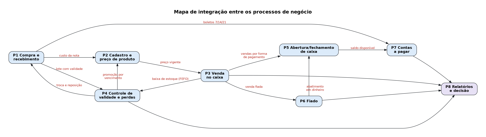

*Figura 1: mapa de integração entre os processos de negócio.*

| Fluxo de informação | O que depende dele |
| --- | --- |
| P1 → P2 (custo da nota) | Sem o custo registrado, a margem é estimada de cabeça e o preço pode ficar abaixo do necessário |
| P1 → P4 (lote com validade) | A lista de validades só existe se a validade for capturada na entrada da mercadoria |
| P1 → P7 (boletos) | As parcelas 7/14/21 nascem do recebimento e alimentam a previsão de pagamentos |
| P2 → P3 (preço vigente) | O caixa cobra o preço que o processo de precificação definiu |
| P3 → P4 (baixa de estoque) | O saldo só se mantém correto se a venda consumir o lote (FEFO) |
| P3 → P5 (vendas por forma de pagamento) | O fechamento do caixa depende de separar dinheiro, cartão, Pix e vale |
| P3 → P6 (venda fiada) | A dívida do cliente nasce da venda, e não de uma anotação avulsa |
| P6 → P5 (abatimento em dinheiro) | Quando o cliente paga o fiado no caixa, esse dinheiro entra na gaveta e precisa entrar na conferência |
| P4 → P2 (promoção por vencimento) | O desconto por proximidade de vencimento é uma alteração de preço com motivo |
| P4 → P1 (troca e reposição) | Produto vencido devolvido ao fornecedor volta como nova entrada |
| P5 → P7 (saldo disponível) | A previsão de caixa usa o que já entrou e o que ainda vai cair |
| P3, P4, P6, P7 → P8 | Todos os relatórios pedidos pelo gerente são consequência desses registros |

---

## 6. Requisitos funcionais

Requisito funcional diz o que o sistema deve fazer. Cada requisito abaixo vem de um problema da seção 4, indicado na coluna "origem".

### 6.1 Produtos, preços e fornecedores

| ID | Requisito | Origem | Entidades envolvidas |
| --- | --- | --- | --- |
| RF-01 | O sistema deverá cadastrar produtos, com identificação da categoria/setor, unidade base, indicação de venda por peso e indicação de controle de validade. | PB-18, PB-19 | PRODUTO, CATEGORIA |
| RF-02 | O sistema deverá cadastrar as formas de venda de um mesmo produto (unidade, pacote, fardo, quilo), cada uma com seu código de barras, preço e fator de conversão para a unidade base. | PB-19 | EMBALAGEM |
| RF-03 | O sistema deverá gerar código de barras interno (faixa de circulação restrita) para itens sem código de fábrica e permitir a busca por nome no caixa. | PB-18 | EMBALAGEM |
| RF-04 | O sistema deverá registrar toda alteração de preço de venda, guardando preço anterior, preço novo, data, hora, motivo e funcionário responsável. | PB-06, PB-11 | HISTORICO_PRECO |
| RF-05 | O sistema deverá sugerir o preço de venda a partir do custo da última compra e da margem de referência do produto. | PB-05 | PRODUTO, LOTE |
| RF-06 | O sistema deverá cadastrar fornecedores com seus contatos/vendedores, canal de pedido e condição de pagamento usual. | Entrevista 3.11 | FORNECEDOR |
| RF-07 | O sistema deverá manter, para cada par produto-fornecedor, o preço e a data da última compra, permitindo comparar fornecedores do mesmo item. | PB-05 | FORNECE (N:N) |

### 6.2 Compras e recebimento

| ID | Requisito | Origem | Entidades envolvidas |
| --- | --- | --- | --- |
| RF-08 | O sistema deverá registrar pedidos de compra, indicando fornecedor, canal (WhatsApp, aplicativo, vendedor), produtos, quantidades e preço negociado. | PB-15 | PEDIDO_COMPRA, SOLICITA |
| RF-09 | O sistema deverá registrar o recebimento da mercadoria com número da nota, valor total, volumes declarados e volumes conferidos. | PB-01, PB-15 | RECEBIMENTO |
| RF-10 | O sistema deverá permitir vincular um recebimento ao pedido correspondente e apontar divergências entre o que foi pedido e o que chegou. | PB-15 | PEDIDO_COMPRA, RECEBIMENTO |
| RF-11 | O sistema deverá permitir registrar recebimento sem pedido prévio (compra direta com vendedor que passa no mercado). | Entrevista 3.3 | RECEBIMENTO |
| RF-12 | O sistema deverá gerar, para cada produto aceito no recebimento, um lote com quantidade, custo unitário e data de validade. | PB-01, PB-03 | LOTE |
| RF-13 | O sistema deverá gerar automaticamente as contas a pagar decorrentes do recebimento, conforme a condição acordada (à vista ou parcelas em 7, 14 e 21 dias). | PB-14 | CONTA_PAGAR |
| RF-14 | O sistema deverá registrar a recusa de um recebimento e o motivo, sem gerar estoque nem contas a pagar. | Entrevista 3.16 | RECEBIMENTO |

### 6.3 Estoque e validade

| ID | Requisito | Origem | Entidades envolvidas |
| --- | --- | --- | --- |
| RF-15 | O sistema deverá controlar o saldo de estoque por produto e por lote, atualizando-o a cada entrada ou saída. | PB-01, PB-02 | LOTE, MOVIMENTACAO_ESTOQUE |
| RF-16 | O sistema deverá registrar toda movimentação de estoque indicando o tipo (entrada por recebimento, saída por venda, devolução de cliente, perda por vencimento, perda por avaria, troca com fornecedor, ajuste de inventário). | PB-04 | MOVIMENTACAO_ESTOQUE |
| RF-17 | O sistema deverá listar os lotes com vencimento dentro do prazo de alerta definido para o produto ou para a categoria. | PB-03 | LOTE, PRODUTO, CATEGORIA |
| RF-18 | O sistema deverá registrar a perda por vencimento e a situação do lote separado para troca com o fornecedor. | PB-04 | LOTE, MOVIMENTACAO_ESTOQUE |
| RF-19 | O sistema deverá emitir alerta quando o saldo do produto ficar abaixo do estoque mínimo definido. | PB-02 | PRODUTO |
| RF-20 | O sistema deverá permitir ajuste manual de estoque (inventário), com motivo e responsável obrigatórios. | Entrevista 2.16 | MOVIMENTACAO_ESTOQUE |
| RF-21 | O sistema deverá baixar o estoque pelo lote de vencimento mais próximo (FEFO) no momento da venda. | PB-03, PB-04 | ITEM_VENDA, LOTE |

### 6.4 Vendas, caixa e fiado

| ID | Requisito | Origem | Entidades envolvidas |
| --- | --- | --- | --- |
| RF-22 | O sistema deverá registrar vendas com seus itens, quantidade, preço praticado e desconto aplicado. | PB-09 | VENDA, ITEM_VENDA |
| RF-23 | O sistema deverá registrar quantidades fracionadas para produtos vendidos por peso (carnes, frutas, verduras). | Entrevista 2.11 | ITEM_VENDA |
| RF-24 | O sistema deverá permitir que uma venda seja paga em mais de uma forma de pagamento, registrando o valor de cada uma. | PB-10 | PAGAMENTO_VENDA, FORMA_PAGAMENTO |
| RF-25 | O sistema deverá registrar a venda fiada vinculada a um cliente identificado e atualizar seu saldo devedor. | PB-07 | CLIENTE, VENDA |
| RF-26 | O sistema deverá registrar pagamentos totais ou parciais da dívida do cliente, mantendo o histórico de cada abatimento. | PB-08 | ABATIMENTO_FIADO |
| RF-27 | O sistema deverá consultar, a qualquer momento, o saldo devedor de cada cliente e o total geral a receber de fiado. | PB-07 | CLIENTE, ABATIMENTO_FIADO |
| RF-28 | O sistema deverá controlar sessões de caixa, com abertura (fundo de troco informado), fechamento, valor contado e diferença apurada. | PB-12 | CAIXA, SESSAO_CAIXA |
| RF-29 | O sistema deverá registrar sangrias e suprimentos, com valor, motivo e responsável. | PB-12 | MOVIMENTACAO_CAIXA |
| RF-30 | O sistema deverá identificar o funcionário que operou cada venda, alteração de preço, recebimento, perda, sangria e abatimento. | PB-11 | FUNCIONARIO |
| RF-31 | O sistema deverá registrar devoluções e trocas de produto pelo cliente, com o motivo e o destino do produto devolvido. | Entrevista 4.9 | MOVIMENTACAO_ESTOQUE |
| RF-32 | O sistema deverá calcular o valor esperado no caixa a partir do fundo inicial, das vendas em dinheiro, dos abatimentos em dinheiro, dos trocos, das sangrias e dos suprimentos. | PB-12 | SESSAO_CAIXA |

### 6.5 Financeiro e relatórios

| ID | Requisito | Origem | Entidades envolvidas |
| --- | --- | --- | --- |
| RF-33 | O sistema deverá registrar contas a pagar de qualquer natureza (fornecedor, Simples Nacional, folha, internet, água, luz, aluguel), com vencimento, prioridade e situação. | PB-14 | CONTA_PAGAR |
| RF-34 | O sistema deverá registrar o pagamento de uma conta com data, valor pago e eventuais juros, e identificar quem pagou. | PB-13, PB-14 | CONTA_PAGAR, FUNCIONARIO |
| RF-35 | O sistema deverá projetar o saldo disponível considerando o dinheiro em caixa e os valores de cartão e Pix ainda a serem creditados, conforme o prazo de cada forma de pagamento. | PB-13 | PAGAMENTO_VENDA, FORMA_PAGAMENTO |
| RF-36 | O sistema deverá alertar o gerente quando as contas a vencer no período superarem o saldo previsto. | PB-13 (pedido explícito) | CONTA_PAGAR, PAGAMENTO_VENDA |
| RF-37 | O sistema deverá apresentar o faturamento do dia separado por forma de pagamento e por caixa. | PB-09, PB-10 | VENDA, PAGAMENTO_VENDA, SESSAO_CAIXA |
| RF-38 | O sistema deverá apurar o lucro bruto do período a partir do preço praticado e do custo do item no momento da venda. | PB-17 | ITEM_VENDA |
| RF-39 | O sistema deverá informar a quantidade vendida por produto em um período, identificando os itens de maior e menor giro. | PB-16 | ITEM_VENDA, VENDA |
| RF-40 | O sistema deverá apresentar relatório de perdas por vencimento por produto e por período. | PB-04 | MOVIMENTACAO_ESTOQUE |
| RF-41 | O sistema deverá apresentar a relação de boletos e contas em aberto ordenada por vencimento e prioridade. | PB-14 | CONTA_PAGAR |
| RF-42 | O sistema deverá controlar o acesso dos funcionários por permissão individual (operar caixa, cadastrar produto, alterar preço, autorizar desconto, conceder fiado, realizar sangria, gerenciar financeiro). | PB-20 | FUNCIONARIO, PERMISSAO |

---

## 7. Requisitos não funcionais

Requisito não funcional diz como o sistema deve funcionar: características, restrições e condições de operação. Eles não descrevem funções e não geram entidades sozinhos, mas afetam o modelo. Exigir autoria e histórico, por exemplo, impede que um valor seja simplesmente sobrescrito.

| ID | Categoria | Requisito | Justificativa na realidade do mercado |
| --- | --- | --- | --- |
| RNF-01 | Controle de acesso | O acesso deverá ser individual (login por funcionário) e as operações liberadas conforme as permissões concedidas a cada um. | As funções se sobrepõem: quase todos operam caixa, mas só alguns cadastram produtos e alteram preços |
| RNF-02 | Auditabilidade | O sistema deverá manter registro de data, hora e funcionário responsável nas operações sensíveis (preço, estoque, caixa, fiado, financeiro). | Pedido explícito: "para evitar confusões sobre alterações indevidas ou extremas" |
| RNF-03 | Desempenho | A consulta de preço por leitura de código de barras deverá responder em tempo compatível com a operação de frente de caixa (inferior a 1 segundo). | Fila do caixa em mercado de bairro, com dois PDVs |
| RNF-04 | Usabilidade | As telas operacionais deverão ser simples o bastante para uso por funcionário sem experiência prévia com sistema de caixa. | Um dos seis funcionários não tem experiência com caixa |
| RNF-05 | Integridade | Nenhuma alteração de saldo de estoque poderá ocorrer sem a movimentação correspondente registrada. | Evita o problema atual de estoque sem origem verificável |
| RNF-06 | Preservação do histórico | Registros operacionais não deverão ser excluídos fisicamente; o encerramento deve ocorrer por mudança de situação (ativo/inativo, aberta/paga). | Hoje a baixa do fiado é "riscar o nome", e a informação se perde |
| RNF-07 | Disponibilidade | A operação de venda deverá continuar funcionando durante instabilidade de internet, com sincronização posterior. | Mercado não pode parar de vender; hoje o caixa é local |
| RNF-08 | Confiabilidade | Deverá haver rotina diária de backup dos dados. | Hoje a informação crítica está em cadernos e papéis, sem cópia |
| RNF-09 | Configurabilidade | Os prazos de alerta de validade e os níveis de estoque mínimo deverão ser parametrizáveis por produto e por categoria. | Alimentos básicos exigem vigilância maior que os demais |
| RNF-10 | Precisão | Valores monetários deverão ser tratados com duas casas decimais e quantidades de itens pesados com três casas. | Venda por quilo de carnes, frutas e verduras |
| RNF-11 | Escalabilidade | O sistema deverá suportar os dois caixas atuais operando simultaneamente e permitir a inclusão de novos caixas e usuários sem alteração estrutural. | Dois PDVs hoje; crescimento previsto |
| RNF-12 | Interoperabilidade | O sistema deverá operar com leitor de código de barras e com balança, e permitir a importação futura de arquivos de nota fiscal eletrônica. | Equipamentos já existentes; digitação manual da nota é o gargalo do recebimento |
| RNF-13 | Privacidade (LGPD) | Dados pessoais de clientes deverão ser coletados apenas para a finalidade do crédito fiado e acessíveis somente a usuários autorizados. | O cadastro de cliente só existe por causa do fiado |

> **Distinção exigida pelo manual.** "O sistema deverá registrar vendas" é funcional: descreve uma função. "O registro de vendas deverá identificar o usuário responsável conforme seu perfil de acesso" é não funcional: descreve uma condição de funcionamento. Por isso os dois aparecem em itens separados (RF-22/RF-30 e RNF-01/RNF-02).

---

## 8. Regras de negócio

As regras abaixo dizem o que pode e o que não pode acontecer no negócio. As cardinalidades da seção 14 e as decisões da seção 17 se apoiam nelas; quando uma cardinalidade for questionada, a justificativa está numa destas regras.

### 8.1 Produto, preço e fornecimento

| ID | Regra | Origem / impacto no modelo |
| --- | --- | --- |
| RN-01 | Todo produto pertence a exatamente uma categoria/setor; uma categoria pode não ter nenhum produto cadastrado ainda. | Setores do mercado → cardinalidade CATEGORIA (0,N) : PRODUTO (1,1) |
| RN-02 | Produto vendido por peso tem quantidade fracionada e unidade base em quilo; os demais têm unidade base em unidade. | Carnes, frutas e verduras → atributos vendido_por_peso e unidade_base |
| RN-03 | Um produto só pode ser vendido se possuir ao menos uma forma de venda (embalagem) ativa; cada forma de venda pertence a um único produto. | Lata, fardo, pacote, quilo → PRODUTO (1,N) : EMBALAGEM (1,1) |
| RN-04 | Toda forma de venda possui código de barras único. Item que não traz código de fábrica recebe um código interno da faixa de circulação restrita (prefixos 20 a 29, reservados pela GS1 para uso interno), impresso em etiqueta. | Cervejas sem código → codigo_barras é a PK de EMBALAGEM |
| RN-05 | O preço de venda é calculado sobre o custo da última compra acrescido da margem: 35% a 40% em itens de giro comum e margem maior em itens de custo baixo. | Política de precificação declarada → RF-05 |
| RN-06 | Toda alteração de preço de venda gera um registro histórico com preço anterior, preço novo, data, hora e motivo. | Impede sobrescrever o preço sem rastro → entidade HISTORICO_PRECO |
| RN-07 | Toda alteração de preço é atribuída ao funcionário que a realizou, e só pode ser feita por quem tem a permissão ALTERAR_PRECO. | "Os funcionários que verificam notas alteram preços" → FUNCIONARIO (0,N) : HISTORICO_PRECO (1,1) |
| RN-08 | Somente funcionário com a permissão CADASTRAR_PRODUTO pode incluir ou alterar produtos e embalagens. | "Nem todos possuem o conhecimento para cadastrar/alterar produtos" |
| RN-09 | O mesmo produto pode ser comprado de vários fornecedores, com preços diferentes; o preço de compra pertence ao par produto-fornecedor, e não ao produto isoladamente. | Diferença de quase um real no leite → relacionamento N:N FORNECE com atributos |

### 8.2 Compras, recebimento e estoque

| ID | Regra | Origem / impacto no modelo |
| --- | --- | --- |
| RN-10 | Todo pedido de compra é dirigido a um único fornecedor e deve conter ao menos um produto. | FORNECEDOR (0,N) : PEDIDO_COMPRA (1,1); PEDIDO (1,N) : PRODUTO (0,N) |
| RN-11 | Um pedido pode ser atendido por mais de uma entrega, pois itens faltantes podem ser entregues posteriormente. | PEDIDO_COMPRA (0,N) : RECEBIMENTO (0,1) |
| RN-12 | Todo recebimento pertence a um fornecedor e é acompanhado de nota fiscal, mesmo quando não houve pedido formal registrado; a nota é identificada pelo CNPJ do fornecedor e pelo seu número. | Vendedor que passa e entrega na hora → recebimento sem pedido; PK de RECEBIMENTO = (cnpj_fornecedor, numero_nota) |
| RN-13 | A conferência do recebimento ocorre em duas etapas: volumes declarados na nota e conferência item a item. Qualquer divergência deve ser registrada. | Procedimento descrito na entrevista → atributos de volumes e situação |
| RN-14 | Recebimento aceito gera um lote por produto aceito e a respectiva movimentação de entrada; recebimento recusado não gera lote nem conta a pagar. | "Quando são muitas divergências, não recebemos a mercadoria" |
| RN-15 | Todo lote de produto com controle de validade deve ter data de validade informada na entrada. | Condição para a lista de validades (prioridade nº 1 do gerente) |
| RN-16 | Toda movimentação de estoque afeta um único lote, e o saldo nunca é alterado sem movimentação correspondente. | Garante auditabilidade (RNF-05) → LOTE (1,N) : MOVIMENTACAO (1,1) |
| RN-17 | A baixa de estoque na venda segue o critério FEFO: sai primeiro o lote que vence primeiro. | Reduz perda por vencimento; justifica ITEM_VENDA gerar várias movimentações |
| RN-18 | Perdas, trocas com fornecedor e ajustes de inventário exigem motivo e funcionário responsável. | Hoje nada é registrado (PB-04) → RF-16, RF-20 |
| RN-19 | Produto vencido é retirado da gôndola e registrado como perda; o lote fica separado para troca e, se o fornecedor trocar, a reposição entra como nova movimentação. | Prática atual do mercado, formalizada |
| RN-20 | Nenhuma venda pode ser registrada fora de uma sessão de caixa aberta. | SESSAO_CAIXA (0,N) : VENDA (1,1) |

### 8.3 Venda, pagamento e fiado

| ID | Regra | Origem / impacto no modelo |
| --- | --- | --- |
| RN-21 | Toda venda possui pelo menos um item, e a soma dos pagamentos deve ser igual ao valor total da venda. | VENDA (1,N) : ITEM_VENDA (1,1) e VENDA (1,N) : PAGAMENTO_VENDA (1,1) |
| RN-22 | O preço praticado e o custo do item são congelados no momento da venda: alterações posteriores de preço ou de custo não modificam vendas já registradas. | Condição para apurar lucro histórico (RF-38) |
| RN-23 | Desconto em item de venda só pode ser aplicado por funcionário com permissão de autorização, e o autorizador fica registrado. | "Os funcionários que realizam alterações dos preços" autorizam desconto |
| RN-24 | Venda com pagamento na forma FIADO exige cliente cadastrado com CPF e autorizado; venda sem fiado pode ser anônima. | CLIENTE (0,N) : VENDA (0,1); FK cpf_cliente opcional em VENDA |
| RN-25 | Um cliente pode ter várias compras fiadas em aberto simultaneamente, desde que esteja autorizado e, havendo limite definido, dentro do limite. | "Sim, mas desde que a pessoa esteja pagando" |
| RN-26 | O saldo devedor do cliente é a soma dos pagamentos em fiado menos a soma dos abatimentos registrados. | Atributo derivado saldo_devedor em CLIENTE |
| RN-27 | O abatimento de fiado pode ser total ou parcial, é sempre vinculado ao cliente e nunca pode ser pago na própria forma FIADO. | Substitui o caderno; permite histórico de pagamentos parciais |
| RN-28 | Devolução ou troca ao cliente só é aceita por defeito do produto ou validade vencida, e gera movimentação de retorno com destino definido (revenda ou descarte). | Política declarada de trocas |

### 8.4 Caixa e financeiro

| ID | Regra | Origem / impacto no modelo |
| --- | --- | --- |
| RN-29 | Sangrias e suprimentos exigem valor, motivo e funcionário responsável, e afetam o valor esperado da sessão de caixa. | Hoje inexistente (PB-12) → MOVIMENTACAO_CAIXA |
| RN-30 | A sessão de caixa é aberta com um fundo de troco informado (não fixo) e fechada com a contagem do dinheiro; a diferença entre contado e esperado é registrada. | "Não é fixo"; conferência atual é informal |
| RN-31 | Um recebimento de mercadoria gera nenhuma conta a pagar (quando pago à vista no ato) ou várias parcelas, conforme o acordo com o fornecedor. | Boletos em 7, 14 e 21 dias → RECEBIMENTO (0,N) : CONTA_PAGAR (0,1) |
| RN-32 | Existem contas a pagar sem vínculo com recebimento: Simples Nacional, folha de funcionários, internet, água, luz e aluguel. | Justifica o lado opcional do relacionamento |
| RN-33 | O valor recebido em cartão e Pix só fica disponível após o prazo da respectiva forma de pagamento; a previsão financeira deve considerar essa data. | "As maquininhas mostram quanto dinheiro tem para cair" → atributo prazo_credito_dias |
| RN-34 | Quando o total das contas a vencer no período superar o saldo previsto, o gerente deve ser alertado. | Pedido explícito e prioritário do gerente → RF-36 |
| RN-35 | Toda operação sensível (venda, preço, estoque, caixa, fiado, pagamento) é atribuída ao funcionário que a executou. | Base do controle por permissão (RF-30, RF-42) |

---

## 9. Restrições e políticas organizacionais

Políticas são decisões da empresa que o sistema precisa respeitar, mesmo quando não há motivo técnico para elas. Ficaram separadas das regras de negócio porque a gerência pode mudá-las sem que o modelo de dados mude.

| ID | Tipo | Política / restrição | Reflexo no sistema |
| --- | --- | --- | --- |
| PO-01 | Alçada | Somente funcionários designados fazem pedidos aos fornecedores. | Permissão específica; pedido sempre vinculado ao solicitante |
| PO-02 | Alçada | Somente os funcionários que conferem notas podem cadastrar produtos e alterar preços. | Permissões CADASTRAR_PRODUTO e ALTERAR_PRECO |
| PO-03 | Comercial | Desconto só é concedido por proximidade de vencimento ou avaria, com autorização. | Motivo obrigatório no histórico de preço e no item de venda |
| PO-04 | Crédito | A concessão de fiado é decisão do gerente e restrita a clientes conhecidos e com histórico de pagamento; apenas o gerente altera a autorização e o limite do cliente. | Atributos autorizado_fiado e limite_fiado, alteráveis por permissão |
| PO-05 | Operacional | O recebimento pode ser conferido por qualquer funcionário disponível no momento da entrega, mas o responsável fica registrado. | FUNCIONARIO (0,N) : RECEBIMENTO (1,1) |
| PO-06 | Financeira | Os boletos são organizados por prioridade e vencimento; havendo insuficiência de caixa, paga-se com juros os de menor prioridade. | Atributos prioridade e juros_pagos |
| PO-07 | Estoque | Produto vencido não pode ser descartado antes da tentativa de troca com o fornecedor. | Situação do lote: SEPARADO_TROCA antes de DESCARTADO |
| PO-08 | Estoque | Mantém-se parte do produto no depósito enquanto o restante fica exposto na gôndola. | Estoque mínimo por produto; alerta de reposição |
| PO-09 | Comercial | Margem padrão de 35% a 40% nos itens de giro comum, podendo ser maior nos itens adquiridos com custo baixo. | Atributo margem_referencia e sugestão de preço |
| PO-10 | Financeira | Alguns fornecedores só operam à vista; a maioria trabalha com boleto parcelado em 7, 14 e 21 dias. | Condição de pagamento padrão por fornecedor |
| PO-11 | Operacional | Apenas operadores habilitados abrem e fecham o caixa; cinco dos seis funcionários estão aptos. | Permissão OPERAR_CAIXA |
| PO-12 | Informacional | Nenhum registro operacional é apagado; encerra-se por mudança de situação, preservando o histórico. | Atributos de situação em vez de exclusão física (RNF-06) |

---

## 10. Fluxogramas

Cada fluxograma mostra o processo como ele passa a funcionar com o sistema, a partir de como funciona hoje. A legenda separa o que a pessoa faz do que o sistema faz sozinho, e cada fluxo indica as entidades envolvidas, o que liga processo, requisito e modelo de dados.

| Símbolo | Significado |
| --- | --- |
| Elipse | Início e fim do processo |
| Retângulo de cantos arredondados | Atividade executada por pessoa |
| Retângulo de cantos retos | Registro ou cálculo automático do sistema (gera ou altera dados) |
| Losango | Decisão, com as saídas "sim" e "não" |
| Retângulo de borda dupla | Caminho de exceção (recusa, bloqueio ou alerta) |

### 10.1 F1 - Compra e recebimento de mercadoria (P1)

O fluxo começa, como hoje, na falta do produto. A diferença é que o sistema detecta a falta (estoque abaixo do mínimo) antes de a gôndola esvaziar. As duas etapas de conferência descritas pelo gerente, volumes e item a item, estão no fluxo, assim como as duas saídas possíveis quando há divergência: aceitar com pendência ou recusar a entrega. No final, o mesmo recebimento gera lotes com validade (PB-03), movimentação de entrada (PB-01/PB-02), sugestão de novo preço (PB-05/PB-06) e contas a pagar (PB-14). É o ponto em que mais processos se encontram no projeto.

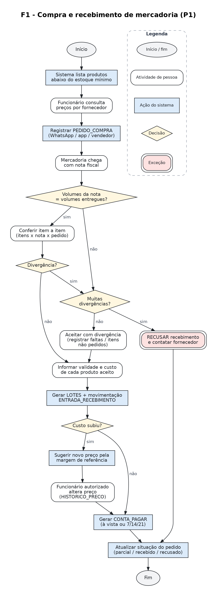

*Figura 2: F1, compra, conferência, entrada em estoque e geração de contas a pagar.*

Requisitos atendidos: RF-08 a RF-14, RF-05. Regras aplicadas: RN-10 a RN-15, RN-31.

### 10.2 F2 - Venda no caixa, incluindo fiado (P3)

A primeira decisão ("sessão de caixa aberta?") aplica a RN-20. Sem ela, não daria para saber no fim do dia quanto deveria haver na gaveta. A busca por nome atende os produtos sem código de barras. No ramo do fiado entra a política PO-04: o sistema verifica se o cliente está cadastrado, autorizado e dentro do limite, coisa que hoje é feita de memória. No final, a venda baixa o estoque por lote, pelo critério FEFO (RN-17), e gera alerta de reposição quando o saldo fica abaixo do mínimo.

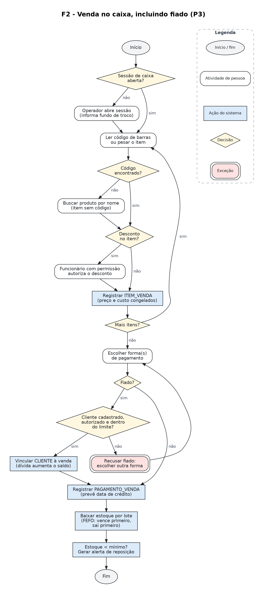

*Figura 3: F2, registro da venda, formas de pagamento, fiado e baixa de estoque.*

Requisitos atendidos: RF-21 a RF-25, RF-28, RF-30. Regras aplicadas: RN-17, RN-20 a RN-25.

### 10.3 F3 - Controle de validade e tratamento de perdas (P4)

Este fluxo atende o problema que o gerente apontou como principal ("validades seriam a principal… já que a vistoria é manual"). Hoje a pessoa procura produtos vencidos na gôndola; com o sistema, ela recebe a lista dos lotes que vencem dentro do prazo de alerta e confere só esses. O fluxo também registra o que hoje se perde: a perda, a separação para troca e a devolução ao fornecedor.

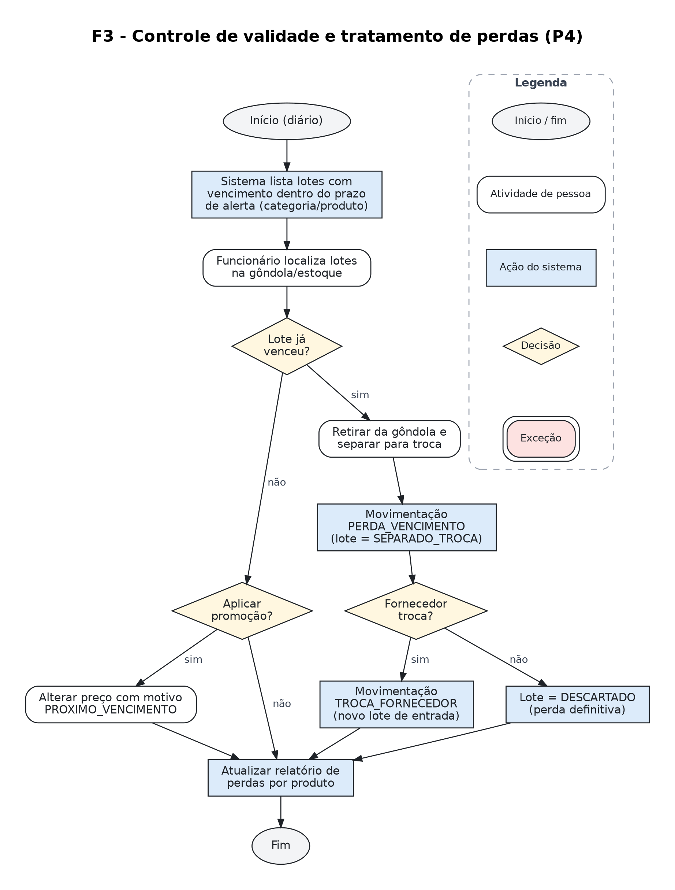

*Figura 4: F3, alerta de vencimento, promoção, perda e troca com o fornecedor.*

Requisitos atendidos: RF-17, RF-18, RF-04, RF-40. Regras aplicadas: RN-15, RN-18, RN-19; política PO-07.

### 10.4 F4 - Abertura, conferência e fechamento de caixa (P5)

O fluxo começa na abertura da sessão, com o fundo de troco informado pelo operador (RN-30); sem esse valor inicial não há como calcular o esperado. No fechamento, em vez de somar relatórios de origens diferentes, o operador compara o valor esperado, calculado pelo sistema, com o valor que contou. As sangrias, que hoje não são registradas, entram no cálculo, e qualquer diferença fica registrada com justificativa. Hoje o mercado nem consegue perceber essas diferenças.

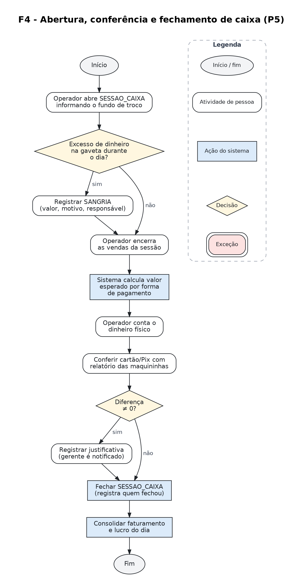

*Figura 5: F4, sessão de caixa, sangrias, conferência e consolidação do dia.*

Requisitos atendidos: RF-28, RF-29, RF-32, RF-37, RF-38. Regras aplicadas: RN-29, RN-30.

### 10.5 F5 - Contas a pagar e previsão de caixa (P7)

Este fluxo contém o alerta de caixa insuficiente, que o gerente disse que seria "sim, muito" útil. O alerta depende de dois registros que hoje não existem de forma organizada: as contas a pagar com vencimento e os recebíveis de cartão e Pix com data prevista de crédito.

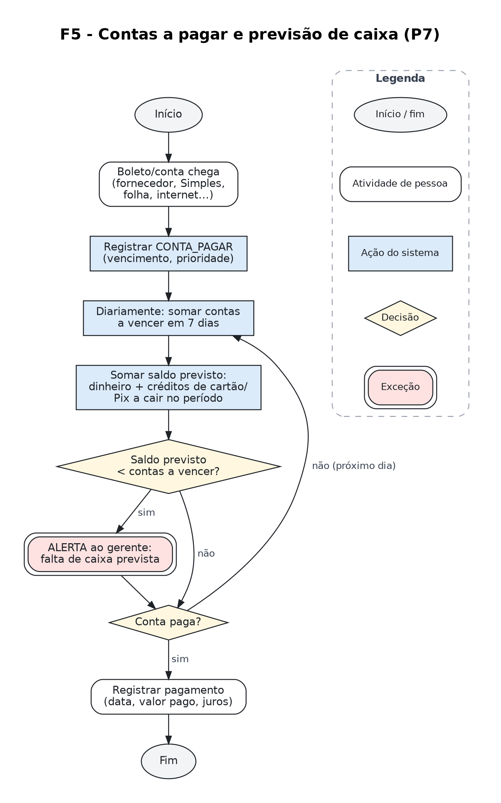

*Figura 6: F5, registro de contas, projeção de saldo e alerta de insuficiência.*

Requisitos atendidos: RF-33 a RF-36, RF-41. Regras aplicadas: RN-31 a RN-34; política PO-06.

### 10.6 F6 - Recebimento de fiado (P6)

Este fluxo substitui o caderno. A diferença está no fim: quando o saldo chega a zero, o cliente fica quitado e o histórico continua guardado (RNF-06). Hoje, riscar o nome apaga a informação. Com o histórico, o mercado pode decidir novas concessões pelo comportamento de pagamento do cliente.

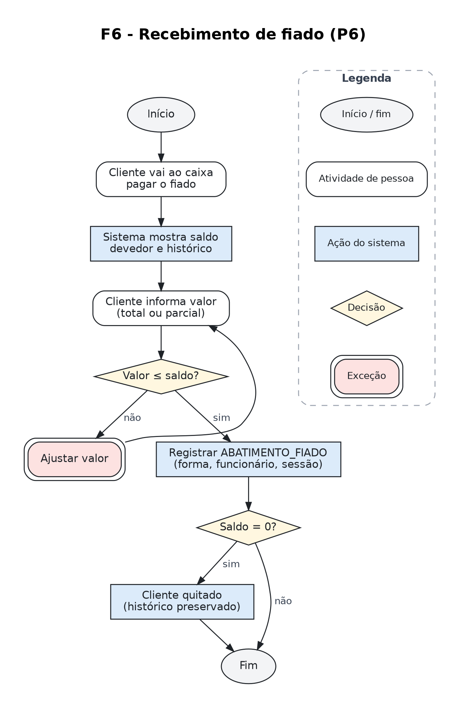

*Figura 7: F6, consulta de saldo devedor, pagamento total ou parcial e quitação.*

Requisitos atendidos: RF-26, RF-27, RF-30. Regras aplicadas: RN-26, RN-27.

> **Coerência entre fluxograma e modelo.** Cada retângulo de cantos retos (ação do sistema) corresponde a uma operação sobre uma entidade do DER, e cada losango corresponde a uma regra da seção 8. Nenhuma atividade dos fluxogramas ficou sem suporte no modelo, e toda entidade é usada por pelo menos um fluxo. A matriz de rastreabilidade ([17.2](#172-matriz-de-rastreabilidade)) consolida essa verificação.

---

## 11. Entidades

As entidades saíram dos substantivos dos requisitos e das regras de negócio, com a pergunta do manual: "isso precisa existir como informação no banco de dados?". Nem todo substantivo virou entidade. A seção 11.3 lista os que foram descartados e o motivo de cada um.

### 11.1 Entidades do modelo

| # | Entidade | Tipo | Por que existe (justificativa de abstração) |
| --- | --- | --- | --- |
| 1 | CATEGORIA | Forte | O mercado se organiza por setores (hortifruti, bebidas, limpeza, alimentos básicos, congelados, carnes) e há política de validade diferente por setor. Sem ela, o prazo de alerta teria de ser repetido em cada produto. |
| 2 | PRODUTO | Forte | É a unidade de controle de estoque, de compra e de análise de giro. Concentra o que não varia com a forma de venda: nome, marca, unidade base, política de validade e estoque mínimo. |
| 3 | EMBALAGEM | Forte | O mesmo produto é vendido em formas diferentes (lata e fardo, unidade e quilo), cada uma com código de barras e preço próprios. Sem essa entidade, ou se perde o preço por forma, ou o estoque de lata e fardo fica incoerente. |
| 4 | HISTORICO_PRECO | Forte | O preço muda com frequência e por motivos distintos (reajuste do fornecedor, vencimento próximo, correção). Guardar apenas o preço atual apagaria a informação, e a autoria, de cada alteração. |
| 5 | LOTE | Forte | É a entidade que viabiliza a prioridade nº 1 do gerente. Validade e custo não pertencem ao produto: pertencem à remessa recebida. Dois lotes do mesmo arroz têm validades e custos diferentes. |
| 6 | MOVIMENTACAO_ESTOQUE | Forte | Representa toda entrada e saída (kardex). É o que garante que o saldo tenha origem verificável e que a perda por vencimento se torne mensurável. |
| 7 | FORNECEDOR | Forte | O mesmo produto vem de fornecedores diferentes com preços diferentes; além disso, o fornecedor é quem entrega, quem troca o vencido e quem emite o boleto. |
| 8 | PEDIDO_COMPRA | Forte | O pedido existe antes da mercadoria e é a referência para verificar divergências. Sem ele não é possível responder "veio menos do que pedi?". |
| 9 | RECEBIMENTO | Forte | É o evento que hoje não é registrado e do qual dependem estoque, validade, custo e contas a pagar. Distingue-se do pedido porque uma entrega pode atender parte de um pedido, ou nenhum pedido. |
| 10 | CONTA_PAGAR | Forte | Cada parcela de boleto e cada despesa fixa é um compromisso com valor, vencimento e prioridade próprios. É a base da previsão de caixa e do alerta solicitado pelo gerente. |
| 11 | CLIENTE | Forte | Só é necessário para o fiado; a maioria das vendas é anônima. Existe porque a dívida precisa de titular, saldo e histórico, substituindo o caderno. |
| 12 | VENDA | Forte | Evento central do negócio: reúne itens, pagamentos, momento, caixa e operador. |
| 13 | ITEM_VENDA | Associativa | Resolve o N:N entre VENDA e EMBALAGEM e carrega informação que não pertence a nenhuma das duas: quantidade, preço praticado, desconto e custo de referência no momento da venda. |
| 14 | FORMA_PAGAMENTO | Forte | Dinheiro, débito, crédito, Pix, vale e fiado têm prazos de crédito e taxas diferentes. É o que permite prever quando o dinheiro estará disponível. |
| 15 | PAGAMENTO_VENDA | Associativa | Uma venda pode ser paga em mais de uma forma (parte em dinheiro, parte no Pix). O valor pago pertence ao par venda-forma, e não à venda. |
| 16 | CAIXA | Forte | O mercado tem dois pontos de venda físicos e precisa comparar o desempenho e a conferência de cada um. |
| 17 | SESSAO_CAIXA | Forte | Um mesmo caixa é aberto e fechado várias vezes, por operadores diferentes. A conferência do dinheiro pertence à sessão, não ao caixa. |
| 18 | MOVIMENTACAO_CAIXA | Forte | Sangrias e suprimentos alteram o dinheiro da gaveta sem serem vendas. Sem registrá-los, o valor esperado no fechamento nunca fecha. |
| 19 | ABATIMENTO_FIADO | Forte | O cliente paga aos poucos e sem vincular o pagamento a uma compra específica. Cada pagamento é um fato com data, valor, forma e responsável. |
| 20 | FUNCIONARIO | Forte | Responde "quem fez", pergunta que hoje o mercado não consegue responder e que o gerente declarou importante para evitar alterações indevidas. |
| 21 | PERMISSAO | Forte | As funções se sobrepõem e não correspondem a cargos fixos; o que define o que cada um pode fazer é a permissão concedida individualmente. |

### 11.2 Entidades por módulo do negócio

| Módulo | Entidades | Processos atendidos |
| --- | --- | --- |
| Produtos e estoque | CATEGORIA, PRODUTO, EMBALAGEM, HISTORICO_PRECO, LOTE, MOVIMENTACAO_ESTOQUE | P2, P4 |
| Compras e fornecedores | FORNECEDOR, PEDIDO_COMPRA, RECEBIMENTO | P1 |
| Vendas e caixa | VENDA, ITEM_VENDA, PAGAMENTO_VENDA, FORMA_PAGAMENTO, CAIXA, SESSAO_CAIXA, MOVIMENTACAO_CAIXA | P3, P5 |
| Financeiro e fiado | CLIENTE, ABATIMENTO_FIADO, CONTA_PAGAR | P6, P7 |
| Pessoas e acesso | FUNCIONARIO, PERMISSAO | Transversal (P1 a P8) |

### 11.3 Substantivos analisados que NÃO viraram entidade

| Candidato | Decisão | Justificativa |
| --- | --- | --- |
| Gôndola / Depósito | Não virou entidade nesta etapa | O mercado tem um único ponto de estoque com duas áreas físicas e não faz transferência formal entre elas. Criar LOCAL_ESTOQUE agora obrigaria o operador a registrar movimentações que ninguém faz hoje. Fica como ponto de evolução (seção 17.3). |
| Nota fiscal | Virou atributo de RECEBIMENTO | Cada entrega corresponde a uma nota; não há informação da nota que exista independentemente do recebimento. Criar entidade separada geraria relacionamento 1:1 sem ganho. |
| Boleto | Virou CONTA_PAGAR | O boleto é a forma física de um compromisso financeiro. Modelar o compromisso permite tratar também Simples Nacional, folha e internet, que não têm boleto de fornecedor. |
| Caderno de fiado | Não é entidade | É o suporte físico que o sistema vai substituir, não um conceito do negócio. O conceito é a dívida do cliente, representada por VENDA fiada e ABATIMENTO_FIADO. |
| Maquininha de cartão | Virou FORMA_PAGAMENTO | O que importa para o modelo é o prazo de crédito e a taxa, e não o equipamento. Se no futuro houver conciliação por operadora, cria-se OPERADORA_CARTAO sem alterar o restante. |
| Cargo / Função | Virou atributo + PERMISSAO | As funções se sobrepõem na prática ("2 pessoas que operam o caixa também alteram preços"). Amarrar permissões ao cargo produziria um modelo incompatível com a realidade descrita. |
| Setor de trabalho do funcionário | Atributo descritivo | O rodízio é informal e diário; registrar alocação por setor criaria dado que ninguém manteria atualizado. O que o sistema precisa controlar é permissão, não lotação. |
| Promoção | Virou motivo no HISTORICO_PRECO | No mercado, promoção é uma alteração temporária de preço motivada por vencimento. Uma entidade PROMOCAO só se justificaria com campanhas planejadas, que não existem hoje. |
| Venda "por peso" | Atributo de PRODUTO | É uma característica do produto, não um tipo distinto de venda: o fluxo de caixa é idêntico, muda apenas a origem da quantidade (balança). |
| Inventário | Tipo de MOVIMENTACAO_ESTOQUE | A conferência física existe (é feita antes dos pedidos), mas o que precisa ser guardado é o ajuste resultante, com motivo e responsável. Uma entidade de contagem completa seria estrutura sem uso atual. |

> **Critério adotado:** uma entidade só foi criada quando (a) tem identidade própria, (b) tem atributos que não pertencem a outra entidade e (c) alguém no mercado precisa consultá-la ou decidir com base nela. Quando faltava um dos três, o conceito virou atributo, domínio de valores ou tipo de outra entidade.

---

## 12. Atributos

Nesta etapa os dados são identificados, descritos e organizados. Tipos físicos e tamanhos ficam para os modelos lógico e físico. A classificação abaixo é a mesma do dicionário de dados (seção 15) e da notação do DER.

| Classificação | Notação no DER | Definição e exemplos neste modelo |
| --- | --- | --- |
| **Chave primária (PK)** | nome (PK) | Atributo ou conjunto de atributos que identifica cada ocorrência de forma única. **Todas as PKs deste modelo são chaves naturais**, formadas por dados que existem no negócio: FUNCIONARIO.cpf, FORNECEDOR.cnpj, EMBALAGEM.codigo_barras, RECEBIMENTO (cnpj_fornecedor, numero_nota). Não foram usadas chaves substitutas (surrogate keys). |
| **Chave estrangeira (FK)** | nome (FK) | Atributo que referencia a PK de outra entidade e materializa um relacionamento. Aparece sempre do lado (1,1) ou (0,1). Ex.: PRODUTO.nome_categoria referencia CATEGORIA; VENDA.cpf_cliente referencia CLIENTE e é opcional (○). |
| **PK e FK ao mesmo tempo** | nome (PK, FK) | Atributo que compõe a chave primária e ao mesmo tempo referencia outra entidade, típico das entidades dependentes. Ex.: ITEM_VENDA (numero_caixa, data_hora_venda) referencia VENDA e, junto com numero_item, forma a PK do item. |
| **Simples obrigatório** | ● nome | Valor único e indivisível, sempre presente. Ex.: LOTE.custo_unitario, CONTA_PAGAR.data_vencimento. |
| **Simples opcional** | ○ nome | Pode não existir na ocorrência. Ex.: PRODUTO.marca (hortifruti), LOTE.data_validade (produtos sem controle de validade). |
| **Composto** | nome (…) | Decomponível em partes com significado próprio. Ex.: CLIENTE.endereco = logradouro, número, complemento e bairro. |
| **Multivalorado** | {nome} | Admite vários valores para a mesma ocorrência. Ex.: FORNECEDOR.contatos: um fornecedor tem vários vendedores, cada um com nome e telefone (é multivalorado e composto). |
| **Derivado** | /nome (itálico) | Calculado a partir de outros dados; não é digitado. Ex.: VENDA.valor_total, CLIENTE.saldo_devedor, LOTE.quantidade_atual, SESSAO_CAIXA.diferenca. |

### 12.1 Decisões relevantes sobre atributos

| Atributo | Decisão e justificativa |
| --- | --- |
| ITEM_VENDA.preco_unitario_praticado | Guarda uma cópia do preço vigente no momento da venda, em vez de consultar a embalagem. Se o preço mudar amanhã, a venda de ontem continua com o valor que foi cobrado (RN-22). |
| ITEM_VENDA.custo_unitario_referencia | Guarda o custo do lote baixado. Sem ele, o lucro do dia, pedido pelo gerente, seria impossível de calcular depois, porque o custo muda a cada compra (PB-05, PB-17). |
| LOTE.quantidade_atual | Derivado das movimentações. Poderia ser mantido como valor materializado por desempenho no modelo físico, mas conceitualmente ele é calculado a partir das movimentações, o que garante a rastreabilidade exigida pelo RNF-05. |
| CLIENTE.saldo_devedor | Derivado: soma dos fiados menos soma dos abatimentos. Não é digitado, justamente para eliminar o erro do caderno, em que o saldo é reescrito manualmente. |
| PAGAMENTO_VENDA.data_prevista_credito | Derivado da data da venda mais o prazo da forma de pagamento. É o atributo que viabiliza a previsão de caixa (RF-35) e o alerta prioritário do gerente (RF-36). |
| EMBALAGEM.fator_conversao | Converte a forma de venda para a unidade base do produto (fardo de 12 = 12 unidades). Sem ele, vender um fardo baixaria "1" do estoque e o saldo ficaria errado, problema clássico em supermercados. |
| FORNECEDOR.contatos | Mantido como multivalorado composto no nível conceitual. No modelo lógico será normalizado em uma tabela própria; registrar essa natureza agora evita a decisão silenciosa de "só um telefone por fornecedor", incompatível com a prática de vários vendedores por distribuidora. |
| MOVIMENTACAO_ESTOQUE.tipo | Domínio enumerado (entrada por recebimento, saída por venda, devolução de cliente, perda por vencimento, perda por avaria, troca com fornecedor, ajuste de inventário). Preferiu-se um atributo de domínio a sete entidades distintas: a estrutura de dados é idêntica e a diferença é semântica. |
| CONTA_PAGAR.prioridade | Reflete uma prática real ("fazemos a contagem do valor final, junto de prioridade"). É um caso em que o modelo incorpora um critério humano existente em vez de impor um novo. |

### 12.2 Quadro de chaves primárias e estrangeiras

O quadro mostra como cada entidade é identificada. Todas as chaves primárias são naturais, formadas por dados do negócio, e cada chave estrangeira indica a entidade que referencia. Quando a PK é composta, os atributos listados juntos formam a chave. A decisão D-13 (seção 17.1) explica essas escolhas.

| Entidade | Chave primária (PK) | Chaves estrangeiras (FK) → entidade referenciada |
| --- | --- | --- |
| CATEGORIA | nome_categoria | (nenhuma) |
| PRODUTO | nome_produto | nome_categoria → CATEGORIA |
| EMBALAGEM | codigo_barras | nome_produto → PRODUTO |
| HISTORICO_PRECO | codigo_barras, data_hora | codigo_barras → EMBALAGEM<br>cpf_funcionario → FUNCIONARIO |
| LOTE | cnpj_fornecedor, numero_nota, nome_produto | cnpj_fornecedor, numero_nota → RECEBIMENTO<br>nome_produto → PRODUTO |
| MOVIMENTACAO_ESTOQUE | cnpj_fornecedor, numero_nota, nome_produto, data_hora | cnpj_fornecedor, numero_nota, nome_produto → LOTE<br>cpf_responsavel → FUNCIONARIO (opcional)<br>numero_caixa_venda, data_hora_venda, numero_item → ITEM_VENDA (opcional) |
| FORNECEDOR | cnpj | (nenhuma) |
| PEDIDO_COMPRA | cnpj_fornecedor, data_hora_pedido | cnpj_fornecedor → FORNECEDOR<br>cpf_funcionario → FUNCIONARIO |
| RECEBIMENTO | cnpj_fornecedor, numero_nota | cnpj_fornecedor → FORNECEDOR<br>data_hora_pedido → PEDIDO_COMPRA (opcional)<br>cpf_conferente → FUNCIONARIO |
| CLIENTE | cpf | (nenhuma) |
| VENDA | numero_caixa, data_hora | numero_caixa, data_hora_abertura → SESSAO_CAIXA<br>cpf_operador → FUNCIONARIO<br>cpf_cliente → CLIENTE (opcional) |
| ITEM_VENDA | numero_caixa, data_hora_venda, numero_item | numero_caixa, data_hora_venda → VENDA<br>codigo_barras → EMBALAGEM<br>cpf_autorizador → FUNCIONARIO (opcional) |
| FORMA_PAGAMENTO | nome_forma | (nenhuma) |
| PAGAMENTO_VENDA | numero_caixa, data_hora_venda, nome_forma | numero_caixa, data_hora_venda → VENDA<br>nome_forma → FORMA_PAGAMENTO |
| CAIXA | numero_caixa | (nenhuma) |
| SESSAO_CAIXA | numero_caixa, data_hora_abertura | numero_caixa → CAIXA<br>cpf_abertura → FUNCIONARIO<br>cpf_fechamento → FUNCIONARIO (opcional) |
| MOVIMENTACAO_CAIXA | numero_caixa, data_hora_abertura, data_hora | numero_caixa, data_hora_abertura → SESSAO_CAIXA<br>cpf_responsavel → FUNCIONARIO |
| ABATIMENTO_FIADO | cpf_cliente, data_hora | cpf_cliente → CLIENTE<br>nome_forma → FORMA_PAGAMENTO<br>cpf_recebedor → FUNCIONARIO<br>numero_caixa, data_hora_abertura → SESSAO_CAIXA (opcional) |
| CONTA_PAGAR | credor, numero_documento, numero_parcela | cnpj_fornecedor, numero_nota → RECEBIMENTO (opcional)<br>cpf_quitante → FUNCIONARIO (opcional) |
| FUNCIONARIO | cpf | (nenhuma) |
| PERMISSAO | codigo_permissao | (nenhuma) |

---

## 13. Relacionamentos

Os relacionamentos saíram dos verbos dos requisitos e das regras de negócio, como pede o manual: "o cliente realiza uma venda", "o funcionário confere o recebimento", "o lote sofre movimentação". Cada um dos 36 relacionamentos abaixo corresponde a algo que acontece no mercado.

Leitura da tabela, na convenção do manual: A (min,max) - verbo - B (min,max). O par ao lado de A indica com quantas ocorrências de B uma ocorrência de A pode se relacionar.

| ID | Relacionamento | Atributos do relacionamento | Justificativa (regra ou fato da entrevista) |
| --- | --- | --- | --- |
| R01 | CATEGORIA (0,N) - **classifica** - PRODUTO (1,1) | | Todo produto pertence a exatamente um setor; um setor recém-criado pode ainda não ter produtos (RN-01). |
| R02 | PRODUTO (1,N) - **é vendido em** - EMBALAGEM (1,1) | | Um produto só é vendável se tiver ao menos uma forma de venda (unidade, fardo, quilo); cada embalagem é de um único produto (RN-03). |
| R03 | EMBALAGEM (0,N) - **registra** - HISTORICO_PRECO (1,1) | | Cada alteração de preço refere-se a uma embalagem; embalagem nova ainda sem alterações (RN-06). |
| R04 | FUNCIONARIO (0,N) - **altera** - HISTORICO_PRECO (1,1) | | Toda alteração de preço tem um responsável identificado (RN-07; entrevista 7.10). |
| R05 | FORNECEDOR (0,N) - **FORNECE** - PRODUTO (0,N) N:N | PK/FK: cnpj_fornecedor + nome_produto; preco_ultima_compra, data_ultima_compra, codigo_no_fornecedor | N:N: um produto pode ser comprado de vários fornecedores e um fornecedor vende vários produtos, com preços diferentes (entrevista 2.9 e 3.10). O preço pertence ao PAR fornecedor-produto. |
| R06 | FORNECEDOR (0,N) - **atende** - PEDIDO_COMPRA (1,1) | | Todo pedido é feito a um único fornecedor (RN-10). |
| R07 | FUNCIONARIO (0,N) - **emite** - PEDIDO_COMPRA (1,1) | | Pedidos são feitos por funcionários específicos (entrevista 3.2). |
| R08 | PEDIDO_COMPRA (1,N) - **SOLICITA** - PRODUTO (0,N) N:N | PK/FK: cnpj_fornecedor + data_hora_pedido + nome_produto; quantidade_pedida, preco_negociado | N:N: um pedido tem ao menos um produto e um produto aparece em vários pedidos. Quantidade e preço negociado descrevem o item do pedido, não o pedido nem o produto. |
| R09 | PEDIDO_COMPRA (0,N) - **é atendido por** - RECEBIMENTO (0,1) | | Um pedido pode chegar em várias entregas (faltantes chegam depois, entrevista 3.16) ou nenhuma (cancelado). Um recebimento pode existir sem pedido registrado (vendedor que passa e entrega na hora). |
| R10 | FORNECEDOR (0,N) - **entrega** - RECEBIMENTO (1,1) | | Todo recebimento tem um fornecedor, mesmo sem pedido prévio (RN-12). |
| R11 | FUNCIONARIO (0,N) - **confere** - RECEBIMENTO (1,1) | | Quem estiver disponível confere (entrevista 3.15); o sistema precisa saber quem foi. |
| R12 | RECEBIMENTO (0,N) - **origina** - LOTE (1,1) | | Cada produto aceito numa entrega vira um lote. Recebimento recusado gera zero lotes (RN-14). |
| R13 | PRODUTO (0,N) - **possui** - LOTE (1,1) | | O estoque do produto é a soma dos saldos dos seus lotes; produto recém-cadastrado pode não ter lote. |
| R14 | LOTE (1,N) - **sofre** - MOVIMENTACAO_ESTOQUE (1,1) | | Todo lote nasce com a movimentação de entrada; cada movimentação afeta um único lote (RN-16). |
| R15 | FUNCIONARIO (0,N) - **registra** - MOVIMENTACAO_ESTOQUE (0,1) | | Perdas, trocas e ajustes manuais exigem responsável; baixas automáticas de venda são rastreadas pelo item de venda (RN-18). |
| R16 | ITEM_VENDA (0,N) - **gera** - MOVIMENTACAO_ESTOQUE (0,1) | | Um item vendido pode baixar mais de um lote (FEFO) e pode ser devolvido. Por isso ITEM_VENDA precisa ser entidade associativa. |
| R17 | RECEBIMENTO (0,N) - **gera** - CONTA_PAGAR (0,1) | | Uma entrega gera 0 parcelas (pago à vista na hora) ou várias (boleto 7/14/21). Contas como luz e Simples Nacional não vêm de recebimento. |
| R18 | FUNCIONARIO (0,N) - **quita** - CONTA_PAGAR (0,1) | | Conta em aberto ainda não tem quem a quitou; ao pagar, o responsável é registrado. |
| R19 | CAIXA (0,N) - **possui** - SESSAO_CAIXA (1,1) | | Cada sessão acontece em um único caixa; um caixa tem várias sessões ao longo do tempo. |
| R20 | FUNCIONARIO (0,N) - **abre** - SESSAO_CAIXA (1,1) | | Operadores abrem o caixa (entrevista 5.6). |
| R21 | FUNCIONARIO (0,N) - **fecha** - SESSAO_CAIXA (0,1) | | Sessão aberta ainda não foi fechada; o fechamento precisa de responsável (entrevista 5.13). |
| R22 | SESSAO_CAIXA (0,N) - **registra** - VENDA (1,1) | | Não existe venda fora de uma sessão de caixa aberta (RN-20). |
| R23 | FUNCIONARIO (0,N) - **opera** - VENDA (1,1) | | Resolve o problema "não conseguimos identificar quem fez a venda" (entrevista 5.16). Fica na VENDA, e não só na sessão, porque quem cobre o almoço opera o mesmo caixa. |
| R24 | CLIENTE (0,N) - **realiza** - VENDA (0,1) | | A maioria das vendas é anônima; só a venda fiada exige cliente (RN-24). |
| R25 | VENDA (1,N) - **contém** - ITEM_VENDA (1,1) | | Uma venda tem ao menos um item (RN-21). |
| R26 | EMBALAGEM (0,N) - **é vendida em** - ITEM_VENDA (1,1) | | O item referencia a embalagem lida no scanner, que determina preço e fator de conversão. |
| R27 | FUNCIONARIO (0,N) - **autoriza desconto** - ITEM_VENDA (0,1) | | Desconto só com autorização de quem tem permissão (entrevista 4.11; RN-23). |
| R28 | VENDA (1,N) - **é paga por** - PAGAMENTO_VENDA (1,1) | | Permite pagamento dividido (parte em dinheiro, parte no Pix). |
| R29 | FORMA_PAGAMENTO (0,N) - **é usada em** - PAGAMENTO_VENDA (1,1) | | Separa o faturamento por forma de pagamento (hoje não é feito, entrevista 5.11). |
| R30 | SESSAO_CAIXA (0,N) - **registra** - MOVIMENTACAO_CAIXA (1,1) | | Sangrias e suprimentos pertencem a uma sessão e entram no valor esperado. |
| R31 | FUNCIONARIO (0,N) - **executa** - MOVIMENTACAO_CAIXA (1,1) | | Toda retirada de dinheiro tem responsável (RN-29). |
| R32 | CLIENTE (0,N) - **paga** - ABATIMENTO_FIADO (1,1) | | O cliente paga aos poucos, sem vínculo com uma venda específica (entrevista 4.6); por isso o abatimento liga-se ao CLIENTE e não à VENDA. |
| R33 | FORMA_PAGAMENTO (0,N) - **é usada em** - ABATIMENTO_FIADO (1,1) | | Cliente pode quitar fiado em dinheiro ou Pix; a forma FIADO não pode ser usada aqui (RN-27). |
| R34 | FUNCIONARIO (0,N) - **recebe** - ABATIMENTO_FIADO (1,1) | | Quem recebeu o pagamento fica registrado. |
| R35 | SESSAO_CAIXA (0,N) - **contabiliza** - ABATIMENTO_FIADO (0,1) | | Abatimento em dinheiro recebido no caixa precisa entrar na conferência da gaveta. |
| R36 | FUNCIONARIO (0,N) - **POSSUI** - PERMISSAO (0,N) N:N | PK/FK: cpf_funcionario + codigo_permissao; data_concessao | N:N: as funções se sobrepõem (entrevista 7.4). Controle por permissão individual, não por cargo fixo. |

---

## 14. Cardinalidades

Seguimos a regra do manual para todas as cardinalidades: nenhuma foi definida olhando um lado só. Para cada relacionamento fizemos as duas perguntas, de ida e de volta, e a tabela registra as respostas junto com a regra de negócio que as sustenta. Onde a resposta foi "várias" nos dois sentidos, o relacionamento foi tratado como N:N (seção 14.2).

Leitura das respostas: (0,N) no mínimo nenhuma, no máximo várias · (1,N) no mínimo uma, no máximo várias · (1,1) exatamente uma · (0,1) no mínimo nenhuma, no máximo uma.

| ID | Pergunta de ida | Resp. | Pergunta de volta | Resp. | Regra |
| --- | --- | --- | --- | --- | --- |
| R01 | Uma CATEGORIA classifica quantos PRODUTOS? | (0,N) | Um PRODUTO está ligado a quantas CATEGORIAS? | (1,1) | RN-01 |
| R02 | Um PRODUTO é vendido em quantas EMBALAGENS? | (1,N) | Uma EMBALAGEM está ligada a quantos PRODUTOS? | (1,1) | RN-03 |
| R03 | Uma EMBALAGEM registra quantos HISTORICO_PRECO? | (0,N) | Um HISTORICO_PRECO está ligado a quantas EMBALAGENS? | (1,1) | RN-06 |
| R04 | Um FUNCIONARIO altera quantos HISTORICO_PRECO? | (0,N) | Um HISTORICO_PRECO está ligado a quantos FUNCIONARIOS? | (1,1) | RN-07 |
| R05 | Um FORNECEDOR fornece quantos PRODUTOS? | (0,N) | Um PRODUTO está ligado a quantos FORNECEDORES? | (0,N) | RN-09 |
| R06 | Um FORNECEDOR atende quantos PEDIDO_COMPRA? | (0,N) | Um PEDIDO_COMPRA está ligado a quantos FORNECEDORES? | (1,1) | RN-10 |
| R07 | Um FUNCIONARIO emite quantos PEDIDO_COMPRA? | (0,N) | Um PEDIDO_COMPRA está ligado a quantos FUNCIONARIOS? | (1,1) | PO-01 |
| R08 | Um PEDIDO_COMPRA solicita quantos PRODUTOS? | (1,N) | Um PRODUTO está ligado a quantos PEDIDO_COMPRA? | (0,N) | RN-10 |
| R09 | Um PEDIDO_COMPRA é atendido por quantos RECEBIMENTOS? | (0,N) | Um RECEBIMENTO está ligado a quantos PEDIDO_COMPRA? | (0,1) | RN-11 |
| R10 | Um FORNECEDOR entrega quantos RECEBIMENTOS? | (0,N) | Um RECEBIMENTO está ligado a quantos FORNECEDORES? | (1,1) | RN-12 |
| R11 | Um FUNCIONARIO confere quantos RECEBIMENTOS? | (0,N) | Um RECEBIMENTO está ligado a quantos FUNCIONARIOS? | (1,1) | PO-05 |
| R12 | Um RECEBIMENTO origina quantos LOTES? | (0,N) | Um LOTE está ligado a quantos RECEBIMENTOS? | (1,1) | RN-14 |
| R13 | Um PRODUTO possui quantos LOTES? | (0,N) | Um LOTE está ligado a quantos PRODUTOS? | (1,1) | RN-16 |
| R14 | Um LOTE sofre quantas MOVIMENTACAO_ESTOQUE? | (1,N) | Uma MOVIMENTACAO_ESTOQUE está ligada a quantos LOTES? | (1,1) | RN-16 |
| R15 | Um FUNCIONARIO registra quantas MOVIMENTACAO_ESTOQUE? | (0,N) | Uma MOVIMENTACAO_ESTOQUE está ligada a quantos FUNCIONARIOS? | (0,1) | RN-18 |
| R16 | Um ITEM_VENDA gera quantas MOVIMENTACAO_ESTOQUE? | (0,N) | Uma MOVIMENTACAO_ESTOQUE está ligada a quantos ITEM_VENDA? | (0,1) | RN-17 |
| R17 | Um RECEBIMENTO gera quantas CONTA_PAGAR? | (0,N) | Uma CONTA_PAGAR está ligada a quantos RECEBIMENTOS? | (0,1) | RN-31 |
| R18 | Um FUNCIONARIO quita quantas CONTA_PAGAR? | (0,N) | Uma CONTA_PAGAR está ligada a quantos FUNCIONARIOS? | (0,1) | RN-35 |
| R19 | Um CAIXA possui quantas SESSAO_CAIXA? | (0,N) | Uma SESSAO_CAIXA está ligada a quantos CAIXAS? | (1,1) | RN-30 |
| R20 | Um FUNCIONARIO abre quantas SESSAO_CAIXA? | (0,N) | Uma SESSAO_CAIXA está ligada a quantos FUNCIONARIOS (abertura)? | (1,1) | PO-11 |
| R21 | Um FUNCIONARIO fecha quantas SESSAO_CAIXA? | (0,N) | Uma SESSAO_CAIXA está ligada a quantos FUNCIONARIOS (fechamento)? | (0,1) | RN-30 |
| R22 | Uma SESSAO_CAIXA registra quantas VENDAS? | (0,N) | Uma VENDA está ligada a quantas SESSAO_CAIXA? | (1,1) | RN-20 |
| R23 | Um FUNCIONARIO opera quantas VENDAS? | (0,N) | Uma VENDA está ligada a quantos FUNCIONARIOS? | (1,1) | RN-35 |
| R24 | Um CLIENTE realiza quantas VENDAS? | (0,N) | Uma VENDA está ligada a quantos CLIENTES? | (0,1) | RN-24 |
| R25 | Uma VENDA contém quantos ITEM_VENDA? | (1,N) | Um ITEM_VENDA está ligado a quantas VENDAS? | (1,1) | RN-21 |
| R26 | Uma EMBALAGEM é vendida em quantos ITEM_VENDA? | (0,N) | Um ITEM_VENDA está ligado a quantas EMBALAGENS? | (1,1) | RN-03 |
| R27 | Um FUNCIONARIO autoriza desconto em quantos ITEM_VENDA? | (0,N) | Um ITEM_VENDA está ligado a quantos FUNCIONARIOS (autorizador)? | (0,1) | RN-23 |
| R28 | Uma VENDA é paga por quantos PAGAMENTO_VENDA? | (1,N) | Um PAGAMENTO_VENDA está ligado a quantas VENDAS? | (1,1) | RN-21 |
| R29 | Uma FORMA_PAGAMENTO é usada em quantos PAGAMENTO_VENDA? | (0,N) | Um PAGAMENTO_VENDA está ligado a quantas FORMA_PAGAMENTO? | (1,1) | RN-33 |
| R30 | Uma SESSAO_CAIXA registra quantas MOVIMENTACAO_CAIXA? | (0,N) | Uma MOVIMENTACAO_CAIXA está ligada a quantas SESSAO_CAIXA? | (1,1) | RN-29 |
| R31 | Um FUNCIONARIO executa quantas MOVIMENTACAO_CAIXA? | (0,N) | Uma MOVIMENTACAO_CAIXA está ligada a quantos FUNCIONARIOS? | (1,1) | RN-29 |
| R32 | Um CLIENTE paga quantos ABATIMENTO_FIADO? | (0,N) | Um ABATIMENTO_FIADO está ligado a quantos CLIENTES? | (1,1) | RN-27 |
| R33 | Uma FORMA_PAGAMENTO é usada em quantos ABATIMENTO_FIADO? | (0,N) | Um ABATIMENTO_FIADO está ligado a quantas FORMA_PAGAMENTO? | (1,1) | RN-27 |
| R34 | Um FUNCIONARIO recebe quantos ABATIMENTO_FIADO? | (0,N) | Um ABATIMENTO_FIADO está ligado a quantos FUNCIONARIOS? | (1,1) | RN-35 |
| R35 | Uma SESSAO_CAIXA contabiliza quantos ABATIMENTO_FIADO? | (0,N) | Um ABATIMENTO_FIADO está ligado a quantas SESSAO_CAIXA? | (0,1) | RN-30 |
| R36 | Um FUNCIONARIO possui quantas PERMISSOES? | (0,N) | Uma PERMISSAO está ligada a quantos FUNCIONARIOS? | (0,N) | RN-35 |

### 14.1 Cardinalidades mínimas: por que 0 e por que 1

A cardinalidade mínima é onde aparecem os detalhes do negócio. Cada caso abaixo foi decidido com base numa regra.

| Situação | Decisão | Por quê |
| --- | --- | --- |
| CLIENTE, VENDA | (0,1) do lado da venda | A maioria das vendas é anônima; exigir cliente em toda venda inviabilizaria o caixa. O cliente só é obrigatório quando há fiado (RN-24), restrição que não é expressa pela cardinalidade, e sim por regra de negócio verificada no fluxo F2. |
| PRODUTO, EMBALAGEM | (1,N) do lado do produto | Produto sem forma de venda não pode ser vendido nem ter preço. Optou-se pelo mínimo 1 porque o cadastro do produto e o da sua forma de venda ocorrem no mesmo ato operacional (RN-03). |
| PRODUTO, LOTE | (0,N) do lado do produto | Produto recém-cadastrado, ou item esgotado há muito tempo, existe sem nenhum lote. Exigir lote impediria cadastrar o produto antes da primeira entrega. |
| LOTE, MOVIMENTACAO_ESTOQUE | (1,N) do lado do lote | Um lote nasce necessariamente de uma movimentação de entrada (RN-14/RN-16). Não existe lote sem origem; é o que impede o "estoque fantasma" de hoje. |
| PEDIDO_COMPRA, RECEBIMENTO | (0,N) e (0,1) | Zero de um lado: pedido cancelado ou ainda não entregue. Zero do outro: entrega de vendedor que passa sem pedido formal (RN-11, RN-12). Vários: o faltante chega em outra entrega. |
| RECEBIMENTO, CONTA_PAGAR | (0,N) e (0,1) | Zero contas quando o fornecedor é pago à vista no ato; várias quando o boleto é parcelado em 7/14/21. E há contas sem recebimento algum: Simples Nacional, folha, internet (RN-31, RN-32). |
| FUNCIONARIO, SESSAO_CAIXA (fecha) | (0,1) | Enquanto a sessão está aberta, ainda não existe quem a fechou. A cardinalidade mínima zero representa um fato temporal do processo, não uma falha de modelagem. |
| FUNCIONARIO, MOVIMENTACAO_ESTOQUE | (0,1) do lado da movimentação | Baixas automáticas geradas pela venda não têm um funcionário que "executou a movimentação"; a autoria é do operador da venda. Já perdas, trocas e ajustes exigem responsável (RN-18). |
| SESSAO_CAIXA, ABATIMENTO_FIADO | (0,1) | O pagamento do fiado em dinheiro entra na gaveta e precisa ser contabilizado na conferência; um pagamento por Pix fora do caixa, não. Daí o mínimo zero. |

### 14.2 Relacionamentos N:N verificados

Com o teste do manual ("uma ocorrência de A pode se relacionar a várias de B? E uma de B a várias de A?"), três relacionamentos deram N:N. Todos representam situações reais do mercado.

| Relacionamento | Verificação nos dois sentidos | Atributos próprios | Tratamento |
| --- | --- | --- | --- |
| R05 FORNECEDOR, FORNECE, PRODUTO | Um fornecedor vende vários produtos. Um produto é comprado de vários fornecedores ("o preço varia de vendedor para vendedor"). Sim nos dois lados. | preco_ultima_compra, data_ultima_compra, codigo_no_fornecedor | Mantido N:N. Identificado pela PK composta (cnpj_fornecedor, nome_produto), ambas FK |
| R08 PEDIDO_COMPRA, SOLICITA, PRODUTO | Um pedido solicita vários produtos. Um produto aparece em vários pedidos ao longo do tempo. Sim nos dois lados. | quantidade_pedida, preco_negociado | Mantido N:N. PK composta (cnpj_fornecedor, data_hora_pedido, nome_produto), todas FK |
| R36 FUNCIONARIO, POSSUI, PERMISSAO | Um funcionário tem várias permissões. Uma permissão é concedida a vários funcionários. Sim nos dois lados. | data_concessao | Mantido N:N. PK composta (cpf_funcionario, codigo_permissao), ambas FK |

> **Caso especial: VENDA x EMBALAGEM.** Esse relacionamento também seria N:N, mas já foi resolvido no conceitual com a entidade associativa ITEM_VENDA. O item de venda guarda quantidade, preço praticado, desconto e custo de referência, e também gera movimentações de estoque (R16), podendo baixar mais de um lote pelo critério FEFO. Um relacionamento não pode se relacionar com outra entidade; uma entidade associativa pode. O mesmo vale para PAGAMENTO_VENDA (VENDA x FORMA_PAGAMENTO), que precisa de valor, situação de crédito e data prevista próprios.

### 14.3 Relacionamentos com atributos próprios

Pergunta do manual: "o relacionamento possui alguma informação própria?". A resposta foi sim em quatro casos. Em todos, o atributo não pertence a nenhuma das duas entidades sozinha:

| Relacionamento | Atributo | Por que não pertence às entidades |
| --- | --- | --- |
| FORNECE | preco_ultima_compra, data_ultima_compra, codigo_no_fornecedor | O preço não é do produto (varia por fornecedor) nem do fornecedor (varia por produto): é do par. O código interno do item no catálogo do fornecedor tem a mesma natureza. |
| SOLICITA | quantidade_pedida, preco_negociado | A quantidade pedida não descreve o produto nem o pedido como um todo; descreve a linha do pedido. É o que permite comparar "o que foi pedido" com "o que chegou" (PB-15). |
| POSSUI (funcionário-permissão) | data_concessao | A data em que a permissão foi concedida pertence ao vínculo, não à pessoa nem à permissão. |
| ITEM_VENDA (associativa) | quantidade, preco_unitario_praticado, desconto_unitario, custo_unitario_referencia | Preço praticado e custo pertencem ao instante da venda daquele item; guardá-los na embalagem faria o passado mudar quando o preço mudasse (RN-22). |

---

## 15. Dicionário de dados conceitual

O dicionário mostra, para cada dado, o que ele é, para que serve, a que entidade pertence e que regra se aplica a ele. A coluna "classificação" segue a legenda da seção 12: PK (chave primária), FK (chave estrangeira), PK, FK (compõe a chave e referencia outra entidade), simples, composto, multivalorado e derivado; obrigatório ou opcional. Nenhuma entidade usa chave substituta (surrogate key). Tipos físicos e tamanhos ficam para as próximas entregas.

### 15.1 Módulo: Produtos e Estoque

#### CATEGORIA

Setor/agrupamento de produtos do mercado (hortifruti, bebidas, limpeza, alimentos básicos, congelados, carnes).

| Atributo | Descrição | Classificação | Regra / observação |
| --- | --- | --- | --- |
| nome_categoria | Nome do setor | PK | Único e obrigatório. Ex.: 'Hortifruti', 'Bebidas' |
| controle_validade_rigoroso | Indica se os produtos do setor exigem vigilância maior de validade | Simples | Sim/Não. Ex.: alimentos básicos = Sim (entrevista 2.15) |
| dias_alerta_validade_padrao | Antecedência padrão (em dias) para alertar vencimento | Simples (opcional) | Usado quando o produto não define o seu próprio prazo |

#### PRODUTO

Item comercializado, independentemente da embalagem em que é vendido. É a unidade de controle de estoque.

| Atributo | Descrição | Classificação | Regra / observação |
| --- | --- | --- | --- |
| nome_produto | Nome completo e padronizado do produto (tipo, marca e variação) | PK | Único e obrigatório. Ex.: 'Arroz Tio João Tipo 1 5 kg'. Segue padrão de escrita definido no cadastro |
| nome_categoria | Setor ao qual o produto pertence | FK | Referencia CATEGORIA. Obrigatório (RN-01) |
| marca | Marca do produto | Simples (opcional) | Pode não existir (ex.: hortifruti) |
| unidade_base | Unidade em que o estoque é contado | Simples | Domínio: UN ou KG |
| vendido_por_peso | Indica venda fracionada pesada na balança | Simples | Sim/Não. Carnes, frutas e verduras = Sim |
| controla_validade | Indica se o produto exige data de validade no lote | Simples | Se Sim, todo lote deve ter data de validade |
| dias_alerta_validade | Antecedência (dias) para alerta de vencimento | Simples (opcional) | Sobrepõe o padrão da categoria |
| estoque_minimo | Quantidade mínima desejada, na unidade base | Simples | Obrigatório, >= 0. Dispara alerta de reposição |
| margem_referencia | Margem de lucro de referência (%) | Simples (opcional) | Apoio à formação de preço (35% a 40% em itens comuns) |
| ativo | Indica se o produto está em comercialização | Simples | Produto inativo não pode ser vendido |
| estoque_atual | Quantidade disponível na unidade base | Derivado | Soma da quantidade_atual dos lotes do produto |

#### EMBALAGEM

Forma de venda de um produto (lata, fardo, pacote, quilo), com código de barras e preço próprios.

| Atributo | Descrição | Classificação | Regra / observação |
| --- | --- | --- | --- |
| codigo_barras | Código EAN lido pelo scanner | PK | Obrigatório e único. Item sem código de fábrica recebe código de circulação restrita (prefixo 20 a 29, reservado pela GS1 para uso interno) |
| nome_produto | Produto ao qual a forma de venda pertence | FK | Referencia PRODUTO. Obrigatório (RN-03) |
| descricao | Descrição da forma de venda | Simples | Obrigatório. Ex.: 'Lata 350 ml', 'Fardo 12 un', 'Quilo' |
| fator_conversao | Quantas unidades base a embalagem representa | Simples | Obrigatório, > 0. Fardo 12 un = 12; Quilo = 1 |
| preco_venda | Preço de venda vigente | Simples | Obrigatório, > 0. Alteração gera HISTORICO_PRECO |
| ativa | Indica se a embalagem pode ser vendida | Simples | Sim/Não |

#### HISTORICO_PRECO

Registro de cada alteração de preço de venda (auditoria e análise).

| Atributo | Descrição | Classificação | Regra / observação |
| --- | --- | --- | --- |
| codigo_barras | Embalagem cujo preço foi alterado | PK, FK | Referencia EMBALAGEM |
| data_hora | Momento da alteração | PK | Preenchido automaticamente; não há duas alterações da mesma embalagem no mesmo instante |
| cpf_funcionario | Funcionário que alterou o preço | FK | Referencia FUNCIONARIO. Obrigatório (RN-07) |
| preco_anterior | Preço antes da alteração | Simples | Obrigatório |
| preco_novo | Preço após a alteração | Simples | Obrigatório, > 0 |
| motivo | Razão da alteração | Simples | Domínio: REAJUSTE_FORNECEDOR, PROXIMO_VENCIMENTO, PROMOCAO, CORRECAO |

#### LOTE

Quantidade de um produto recebida em uma mesma nota com a mesma validade. Base do controle de validade.

| Atributo | Descrição | Classificação | Regra / observação |
| --- | --- | --- | --- |
| cnpj_fornecedor | Fornecedor da nota que originou o lote | PK, FK | Referencia RECEBIMENTO (junto com numero_nota) |
| numero_nota | Nota fiscal que originou o lote | PK, FK | Referencia RECEBIMENTO (junto com cnpj_fornecedor) |
| nome_produto | Produto do lote | PK, FK | Referencia PRODUTO. Um lote por produto em cada nota |
| quantidade_recebida | Quantidade que entrou, na unidade base | Simples | Obrigatório, > 0 |
| custo_unitario | Valor pago por unidade base, conforme a nota | Simples | Obrigatório; base do cálculo de lucro |
| data_validade | Data de vencimento do lote | Simples (opcional) | Obrigatória se PRODUTO.controla_validade = Sim |
| situacao | Estado do lote | Simples | Domínio: DISPONIVEL, SEPARADO_TROCA, ESGOTADO, DESCARTADO |
| quantidade_atual | Saldo atual do lote | Derivado | Entradas menos saídas das movimentações do lote |
| dias_para_vencer | Dias restantes até a validade | Derivado | data_validade menos a data atual |

#### MOVIMENTACAO_ESTOQUE

Toda entrada ou saída de estoque de um lote (kardex). Nada altera o estoque sem gerar uma movimentação.

| Atributo | Descrição | Classificação | Regra / observação |
| --- | --- | --- | --- |
| cnpj_fornecedor | Parte da chave do lote movimentado | PK, FK | Referencia LOTE (com numero_nota e nome_produto) |
| numero_nota | Parte da chave do lote movimentado | PK, FK | Referencia LOTE |
| nome_produto | Parte da chave do lote movimentado | PK, FK | Referencia LOTE |
| data_hora | Momento da movimentação | PK | Automático, registrado com fração de segundo |
| tipo | Natureza da movimentação | Simples | Domínio: ENTRADA_RECEBIMENTO, SAIDA_VENDA, DEVOLUCAO_CLIENTE, PERDA_VENCIMENTO, PERDA_AVARIA, TROCA_FORNECEDOR, AJUSTE_INVENTARIO |
| quantidade | Quantidade movimentada, na unidade base | Simples | Obrigatório, > 0; o tipo define se soma ou subtrai |
| motivo | Justificativa textual | Simples (opcional) | Obrigatório para perdas e ajustes de inventário |
| cpf_responsavel | Funcionário que registrou perda, troca ou ajuste | FK (opcional) | Referencia FUNCIONARIO. Obrigatório exceto em baixa automática de venda (RN-18) |
| numero_caixa_venda | Caixa da venda que gerou a baixa | FK (opcional) | Referencia ITEM_VENDA (com data_hora_venda e numero_item) |
| data_hora_venda | Momento da venda que gerou a baixa | FK (opcional) | Referencia ITEM_VENDA |
| numero_item | Item do cupom que gerou a baixa | FK (opcional) | Referencia ITEM_VENDA. Preenchido só no tipo SAIDA_VENDA |

### 15.2 Módulo: Compras e Fornecedores

#### FORNECEDOR

Empresa ou distribuidor que vende mercadorias ao mercado.

| Atributo | Descrição | Classificação | Regra / observação |
| --- | --- | --- | --- |
| cnpj | Documento do fornecedor | PK | Obrigatório e único |
| razao_social | Nome jurídico | Simples | Obrigatório |
| nome_fantasia | Nome comercial | Simples (opcional) | |
| contatos | Vendedores/representantes: nome, telefone, WhatsApp | Multivalorado e composto | Um fornecedor pode ter vários vendedores (entrevista 3.11) |
| canal_pedido | Meio usual de pedido | Simples | Domínio: WHATSAPP, APLICATIVO, VENDEDOR_VISITA |
| condicao_pagamento_padrao | Prazo usual de pagamento | Simples (opcional) | Ex.: 'À vista', '7/14/21 dias' |
| ativo | Indica se o fornecedor está em uso | Simples | Sim/Não |

#### PEDIDO_COMPRA

Solicitação de mercadorias feita a um fornecedor.

| Atributo | Descrição | Classificação | Regra / observação |
| --- | --- | --- | --- |
| cnpj_fornecedor | Fornecedor a quem o pedido foi feito | PK, FK | Referencia FORNECEDOR (RN-10) |
| data_hora_pedido | Momento em que o pedido foi feito | PK | Obrigatório |
| cpf_funcionario | Funcionário que fez o pedido | FK | Referencia FUNCIONARIO. Obrigatório (PO-01) |
| canal | Meio utilizado no pedido | Simples | Domínio: WHATSAPP, APLICATIVO, VENDEDOR_VISITA |
| situacao | Andamento do pedido | Simples | Domínio: ABERTO, PARCIALMENTE_RECEBIDO, RECEBIDO, CANCELADO |
| observacao | Anotações do pedido | Simples (opcional) | |
| valor_previsto | Valor total esperado | Derivado | Soma de quantidade x preço negociado dos produtos solicitados |

#### RECEBIMENTO

Chegada física de mercadorias acompanhada de nota fiscal, com o resultado da conferência.

| Atributo | Descrição | Classificação | Regra / observação |
| --- | --- | --- | --- |
| cnpj_fornecedor | Fornecedor que emitiu a nota | PK, FK | Referencia FORNECEDOR (RN-12) |
| numero_nota | Número da nota fiscal | PK | Obrigatório; único por fornecedor |
| data_hora_pedido | Pedido atendido por esta entrega | FK (opcional) | Referencia PEDIDO_COMPRA (com cnpj_fornecedor). Vazio se não houve pedido (RN-11, RN-12) |
| cpf_conferente | Funcionário que conferiu a entrega | FK | Referencia FUNCIONARIO. Obrigatório (PO-05) |
| data_hora | Momento da chegada | Simples | Obrigatório |
| valor_total_nota | Valor total da nota | Simples | Obrigatório; base das contas a pagar |
| volumes_nota | Quantidade de volumes declarada na nota | Simples | Primeira etapa da conferência (entrevista 3.5) |
| volumes_conferidos | Quantidade de volumes efetivamente recebida | Simples | |
| situacao | Resultado da conferência | Simples | Domínio: ACEITO, ACEITO_COM_DIVERGENCIA, RECUSADO |
| observacao_divergencia | Descrição de faltas ou itens não pedidos | Simples (opcional) | Obrigatório se houver divergência |

### 15.3 Módulo: Vendas e Caixa

#### VENDA

Transação de venda registrada no caixa.

| Atributo | Descrição | Classificação | Regra / observação |
| --- | --- | --- | --- |
| numero_caixa | Caixa em que a venda ocorreu | PK, FK | Referencia SESSAO_CAIXA (com data_hora_abertura) |
| data_hora | Momento da venda | PK | Automático; um caixa não registra duas vendas no mesmo instante |
| data_hora_abertura | Sessão de caixa em que a venda ocorreu | FK | Referencia SESSAO_CAIXA. Obrigatório (RN-20) |
| cpf_operador | Funcionário que operou a venda | FK | Referencia FUNCIONARIO. Obrigatório (entrevista 5.16) |
| cpf_cliente | Cliente identificado | FK (opcional) | Referencia CLIENTE. Obrigatório se houver pagamento FIADO (RN-24) |
| situacao | Estado da venda | Simples | Domínio: CONCLUIDA, CANCELADA |
| valor_bruto | Soma dos itens sem desconto | Derivado | Σ quantidade x preço praticado |
| valor_desconto | Soma dos descontos | Derivado | Σ quantidade x desconto unitário |
| valor_total | Valor a pagar | Derivado | valor_bruto menos valor_desconto; deve igualar Σ pagamentos |

#### ITEM_VENDA

Entidade associativa: cada linha de produto de uma venda (VENDA x EMBALAGEM).

| Atributo | Descrição | Classificação | Regra / observação |
| --- | --- | --- | --- |
| numero_caixa | Caixa da venda | PK, FK | Referencia VENDA (com data_hora_venda) |
| data_hora_venda | Momento da venda | PK, FK | Referencia VENDA |
| numero_item | Posição do item no cupom (001, 002…) | PK | Número impresso no cupom da venda |
| codigo_barras | Forma de venda lida no scanner | FK | Referencia EMBALAGEM. Obrigatório |
| cpf_autorizador | Funcionário que autorizou o desconto | FK (opcional) | Referencia FUNCIONARIO. Obrigatório se houver desconto (RN-23) |
| quantidade | Quantidade vendida | Simples | > 0; decimal para itens pesados (kg) |
| preco_unitario_praticado | Preço no momento da venda | Simples | Cópia do preço vigente; não muda se o preço mudar depois |
| desconto_unitario | Desconto concedido por unidade | Simples | Padrão 0 |
| custo_unitario_referencia | Custo do item no momento da venda | Simples | Obtido do(s) lote(s) baixado(s); base do lucro do dia |
| valor_item | Valor líquido do item | Derivado | quantidade x (preço menos desconto) |

#### FORMA_PAGAMENTO

Meio de pagamento aceito (dinheiro, débito, crédito, Pix, vale, fiado).

| Atributo | Descrição | Classificação | Regra / observação |
| --- | --- | --- | --- |
| nome_forma | Nome da forma de pagamento | PK | Único. Ex.: DINHEIRO, DEBITO, CREDITO, PIX, VALE, FIADO |
| prazo_credito_dias | Dias até o dinheiro estar disponível | Simples | Dinheiro/Pix = 0; crédito conforme maquininha |
| taxa_percentual | Taxa cobrada pela operadora | Simples | Padrão 0 |
| gera_divida | Indica se a forma cria dívida do cliente | Simples | Somente FIADO = Sim |
| ativa | Indica se está disponível no caixa | Simples | Sim/Não |

#### PAGAMENTO_VENDA

Parcela de pagamento de uma venda em uma forma de pagamento (permite pagamento dividido).

| Atributo | Descrição | Classificação | Regra / observação |
| --- | --- | --- | --- |
| numero_caixa | Caixa da venda | PK, FK | Referencia VENDA (com data_hora_venda) |
| data_hora_venda | Momento da venda | PK, FK | Referencia VENDA |
| nome_forma | Forma de pagamento utilizada | PK, FK | Referencia FORMA_PAGAMENTO. Um registro por forma em cada venda |
| valor | Valor pago nesta forma | Simples | > 0 |
| valor_entregue | Valor entregue pelo cliente em dinheiro | Simples (opcional) | Só para dinheiro |
| troco | Troco devolvido | Derivado | valor_entregue menos valor |
| data_prevista_credito | Quando o valor estará disponível | Derivado | Data da venda + prazo_credito_dias da forma |
| situacao_credito | Se o valor já caiu na conta | Simples | Domínio: PENDENTE, CREDITADO |

#### CAIXA

Ponto de venda físico (o mercado possui 2).

| Atributo | Descrição | Classificação | Regra / observação |
| --- | --- | --- | --- |
| numero_caixa | Número físico do ponto de venda | PK | Único. Ex.: 1, 2 |
| ativo | Indica se o caixa está em uso | Simples | Sim/Não |

#### SESSAO_CAIXA

Período entre a abertura e o fechamento de um caixa por um operador.

| Atributo | Descrição | Classificação | Regra / observação |
| --- | --- | --- | --- |
| numero_caixa | Caixa aberto | PK, FK | Referencia CAIXA |
| data_hora_abertura | Momento da abertura | PK | Automático |
| cpf_abertura | Funcionário que abriu a sessão | FK | Referencia FUNCIONARIO. Obrigatório |
| cpf_fechamento | Funcionário que fechou a sessão | FK (opcional) | Referencia FUNCIONARIO. Vazio enquanto aberta |
| valor_inicial | Fundo de troco informado na abertura | Simples | Obrigatório, >= 0 (não é fixo) |
| data_hora_fechamento | Momento do fechamento | Simples (opcional) | Vazio enquanto a sessão estiver aberta |
| valor_contado | Dinheiro físico contado no fechamento | Simples (opcional) | Obrigatório para fechar |
| situacao | Estado da sessão | Simples | Domínio: ABERTA, FECHADA |
| valor_esperado | Dinheiro que deveria haver na gaveta | Derivado | Inicial + vendas em dinheiro + abatimentos em dinheiro + suprimentos, menos sangrias e trocos |
| diferenca | Sobra ou falta de caixa | Derivado | valor_contado menos valor_esperado |

#### MOVIMENTACAO_CAIXA

Retirada (sangria) ou reforço (suprimento) de dinheiro na gaveta.

| Atributo | Descrição | Classificação | Regra / observação |
| --- | --- | --- | --- |
| numero_caixa | Caixa da sessão | PK, FK | Referencia SESSAO_CAIXA (com data_hora_abertura) |
| data_hora_abertura | Sessão em que ocorreu | PK, FK | Referencia SESSAO_CAIXA |
| data_hora | Momento da movimentação | PK | Automático |
| cpf_responsavel | Funcionário que executou | FK | Referencia FUNCIONARIO. Obrigatório (RN-29) |
| tipo | Natureza da movimentação | Simples | Domínio: SANGRIA, SUPRIMENTO |
| valor | Valor movimentado | Simples | > 0 |
| motivo | Justificativa | Simples | Obrigatório |

### 15.4 Módulo: Financeiro e Fiado

#### CLIENTE

Consumidor identificado. O cadastro só é exigido para venda fiada.

| Atributo | Descrição | Classificação | Regra / observação |
| --- | --- | --- | --- |
| cpf | Documento do cliente | PK | Obrigatório e único; passa a ser exigido na concessão de fiado |
| nome | Nome do cliente | Simples | Obrigatório |
| apelido | Como o cliente é conhecido no bairro | Simples (opcional) | Facilita a identificação no balcão |
| telefone | Telefone de contato | Simples (opcional) | |
| endereco | Logradouro, número, complemento, bairro | Composto (opcional) | |
| autorizado_fiado | Indica se pode comprar fiado | Simples | Somente o gerente altera (política PO-04) |
| limite_fiado | Valor máximo de dívida em aberto | Simples (opcional) | Se informado, bloqueia fiado acima do limite |
| data_cadastro | Data do cadastro | Simples | Automático |
| saldo_devedor | Quanto o cliente deve hoje | Derivado | Soma dos pagamentos FIADO menos soma dos abatimentos |

#### ABATIMENTO_FIADO

Pagamento (total ou parcial) feito pelo cliente para reduzir sua dívida de fiado.

| Atributo | Descrição | Classificação | Regra / observação |
| --- | --- | --- | --- |
| cpf_cliente | Cliente que pagou | PK, FK | Referencia CLIENTE |
| data_hora | Momento do pagamento | PK | Automático |
| nome_forma | Forma usada no pagamento | FK | Referencia FORMA_PAGAMENTO. Não pode ser FIADO (RN-27) |
| cpf_recebedor | Funcionário que recebeu | FK | Referencia FUNCIONARIO. Obrigatório |
| numero_caixa | Caixa em que o dinheiro entrou | FK (opcional) | Referencia SESSAO_CAIXA (com data_hora_abertura) |
| data_hora_abertura | Sessão em que o dinheiro entrou | FK (opcional) | Referencia SESSAO_CAIXA. Obrigatório quando pago em dinheiro no caixa |
| valor | Valor pago | Simples | > 0 e <= saldo devedor do cliente |
| observacao | Anotação livre | Simples (opcional) | |

#### CONTA_PAGAR

Compromisso financeiro do mercado: boleto de fornecedor, imposto, folha, internet etc.

| Atributo | Descrição | Classificação | Regra / observação |
| --- | --- | --- | --- |
| credor | Quem recebe o pagamento | PK | Ex.: razão social do fornecedor, 'Receita Federal', operadora de internet |
| numero_documento | Número do boleto, da guia, da fatura ou competência da folha | PK | Ex.: nº do boleto; 'DAS 09/2026'; 'FOLHA 09/2026' |
| numero_parcela | Parcela do documento | PK | 1 para conta única; 1, 2, 3 no boleto 7/14/21 |
| cnpj_fornecedor | Fornecedor da nota que gerou a conta | FK (opcional) | Referencia RECEBIMENTO (com numero_nota). Vazio em despesas fixas (RN-32) |
| numero_nota | Nota que gerou a conta | FK (opcional) | Referencia RECEBIMENTO |
| cpf_quitante | Funcionário que registrou o pagamento | FK (opcional) | Referencia FUNCIONARIO. Vazio enquanto em aberto |
| descricao | Descrição da conta | Simples | Obrigatório |
| categoria_despesa | Tipo de despesa | Simples | Domínio: FORNECEDOR, SIMPLES_NACIONAL, FOLHA, INTERNET, AGUA, LUZ, ALUGUEL, OUTROS |
| valor | Valor original | Simples | > 0 |
| data_vencimento | Data de vencimento | Simples | Obrigatório |
| prioridade | Prioridade de pagamento | Simples | Domínio: ALTA, MEDIA, BAIXA (entrevista 6.4) |
| data_pagamento | Data em que foi paga | Simples (opcional) | Vazio enquanto em aberto |
| valor_pago | Valor efetivamente pago | Simples (opcional) | Obrigatório ao quitar |
| situacao | Estado da conta | Simples | Domínio: ABERTA, PAGA, CANCELADA |
| juros_pagos | Encargos por atraso | Derivado | valor_pago menos valor, quando positivo |
| vencida | Se está em aberto após o vencimento | Derivado | situacao = ABERTA e data atual > data_vencimento |

### 15.5 Módulo: Pessoas e Acesso

#### FUNCIONARIO

Pessoa que trabalha no mercado e utiliza o sistema.

| Atributo | Descrição | Classificação | Regra / observação |
| --- | --- | --- | --- |
| cpf | Documento do funcionário | PK | Obrigatório e único |
| nome | Nome completo | Simples | Obrigatório |
| telefone | Telefone de contato | Simples (opcional) | |
| funcao_principal | Função habitual (caixa, padaria/balança, reposição, gerência) | Simples | Descritiva; o que ele PODE fazer é definido por PERMISSAO |
| login | Nome de usuário no sistema | Simples | Obrigatório e único |
| data_admissao | Data de admissão | Simples | |
| ativo | Indica se o funcionário está ativo | Simples | Inativo não acessa o sistema |

#### PERMISSAO

Operação sensível do sistema que precisa ser liberada individualmente.

| Atributo | Descrição | Classificação | Regra / observação |
| --- | --- | --- | --- |
| codigo_permissao | Código da permissão | PK | Único. Ex.: OPERAR_CAIXA, CADASTRAR_PRODUTO, ALTERAR_PRECO, RECEBER_MERCADORIA, REGISTRAR_PERDA, AJUSTAR_ESTOQUE, AUTORIZAR_DESCONTO, CONCEDER_FIADO, REALIZAR_SANGRIA, GERENCIAR_FINANCEIRO, GERENCIAR_USUARIOS |
| descricao | O que a permissão libera | Simples | Obrigatório |

### 15.6 Relacionamentos N:N e suas chaves

Relacionamentos N:N não possuem chave própria: são identificados pela combinação das PKs das entidades participantes, que funcionam ao mesmo tempo como FK.

#### FORNECE (R05)

| Atributo | Classificação | Descrição / regra |
| --- | --- | --- |
| cnpj_fornecedor | PK, FK | Referencia FORNECEDOR |
| nome_produto | PK, FK | Referencia PRODUTO |
| preco_ultima_compra | Simples | Preço pago na última compra deste produto a este fornecedor |
| data_ultima_compra | Simples | Data da última compra |
| codigo_no_fornecedor | Simples (opcional) | Código do item no catálogo do fornecedor |

#### SOLICITA (R08)

| Atributo | Classificação | Descrição / regra |
| --- | --- | --- |
| cnpj_fornecedor | PK, FK | Referencia PEDIDO_COMPRA (com data_hora_pedido) |
| data_hora_pedido | PK, FK | Referencia PEDIDO_COMPRA |
| nome_produto | PK, FK | Referencia PRODUTO |
| quantidade_pedida | Simples | > 0, na unidade de compra |
| preco_negociado | Simples (opcional) | Preço combinado com o vendedor |

#### POSSUI (R36)

| Atributo | Classificação | Descrição / regra |
| --- | --- | --- |
| cpf_funcionario | PK, FK | Referencia FUNCIONARIO |
| codigo_permissao | PK, FK | Referencia PERMISSAO |
| data_concessao | Simples | Data em que a permissão foi concedida |

---

## 16. DER

O DER foi desenhado depois das etapas anteriores, a partir delas. A notação é a de Peter Chen, exigida no modelo conceitual: retângulos para entidades, losangos para relacionamentos e pares (mínimo, máximo) para as cardinalidades. Dentro de cada entidade aparecem os atributos, com a chave primária (PK) no topo e as chaves estrangeiras (FK) identificadas.

### 16.1 Notação

| Elemento | Representação |
| --- | --- |
| Entidade | Retângulo com o nome no cabeçalho |
| Chave primária | nome (PK), no topo da lista |
| Chave estrangeira | nome (FK), ou nome (PK, FK) quando também compõe a PK |
| Atributo obrigatório / opcional | ● obrigatório · ○ opcional |
| Atributo composto / multivalorado / derivado | nome (…) · {nome} · /nome |
| Relacionamento | Losango com o verbo; losango de borda dupla indica N:N |
| Cardinalidade | Par (min,max) sobre o trecho de linha que liga o losango à entidade a que se refere |
| Atributos e chave de relacionamento N:N | Nota ligada ao losango por linha tracejada |
| Entidade de borda tracejada (nos diagramas por módulo) | Entidade que pertence a outro módulo, exibida apenas para dar contexto |

### 16.2 Visão geral do modelo

A visão geral mostra as 21 entidades e os 36 relacionamentos com suas cardinalidades, e permite ver de uma vez como os módulos se ligam. FUNCIONARIO aparece em todos eles (PB-11), e a sequência RECEBIMENTO → LOTE → MOVIMENTACAO_ESTOQUE sustenta estoque, validade e custo.

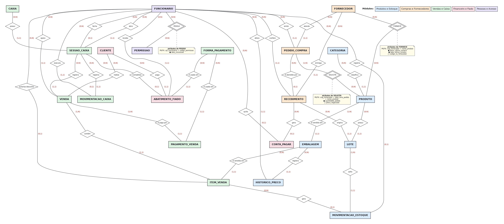

*Figura 8: DER completo em notação Chen (visão geral, sem atributos, para leitura da estrutura).*

As versões ampliadas estão abaixo e na pasta [`docs/der/`](docs/der/). Clique na imagem para abrir em tamanho original.

[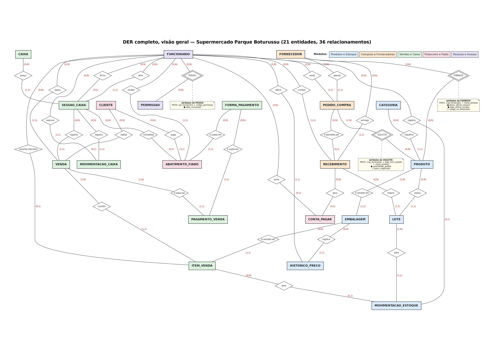](docs/der/figura-14-der-visao-geral-a3.png)

*Figura 14: DER, visão geral em tamanho A3 (21 entidades, 36 relacionamentos).*

[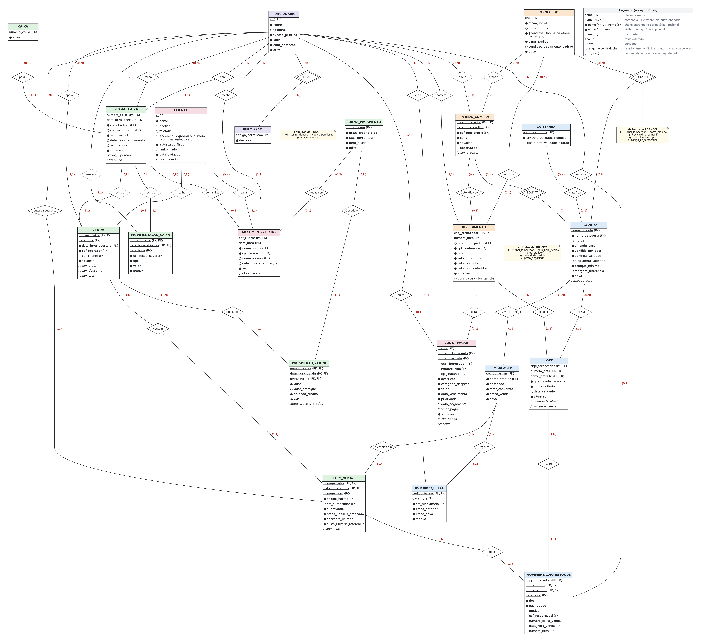](docs/der/der-completo-atributos.png)

*DER completo com todos os atributos e legenda da notação.*

### 16.3 DER por módulo: Produtos e Estoque

Este módulo atende as prioridades nº 1 e nº 3 do gerente. Na sequência PRODUTO → LOTE → MOVIMENTACAO_ESTOQUE, a validade fica no lote, porque cada remessa tem a sua, e o saldo é calculado a partir das movimentações, para que cada quantidade tenha origem conhecida.

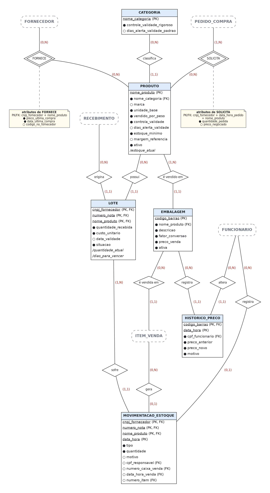

*Figura 9: módulo Produtos e Estoque.*

### 16.4 DER por módulo: Compras e Fornecedores

Os dois relacionamentos que mais exigiram análise estão aqui: R09 (um pedido pode ser atendido por várias entregas, e uma entrega pode não ter pedido) e R17 (uma entrega pode gerar nenhuma ou várias contas a pagar). As duas cardinalidades vieram de respostas da entrevista.

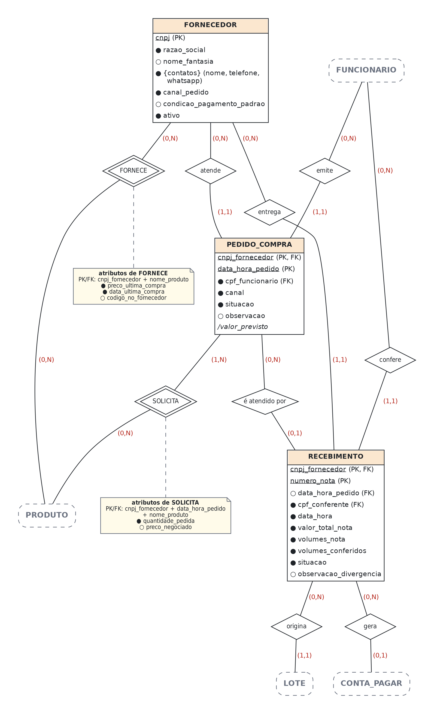

*Figura 10: módulo Compras e Fornecedores.*

### 16.5 DER por módulo: Vendas e Caixa

O módulo cobre o registro da venda com o operador identificado, o pagamento em mais de uma forma e a conferência da gaveta. ITEM_VENDA é entidade associativa porque precisa se relacionar com MOVIMENTACAO_ESTOQUE, e um relacionamento comum não poderia fazer isso.

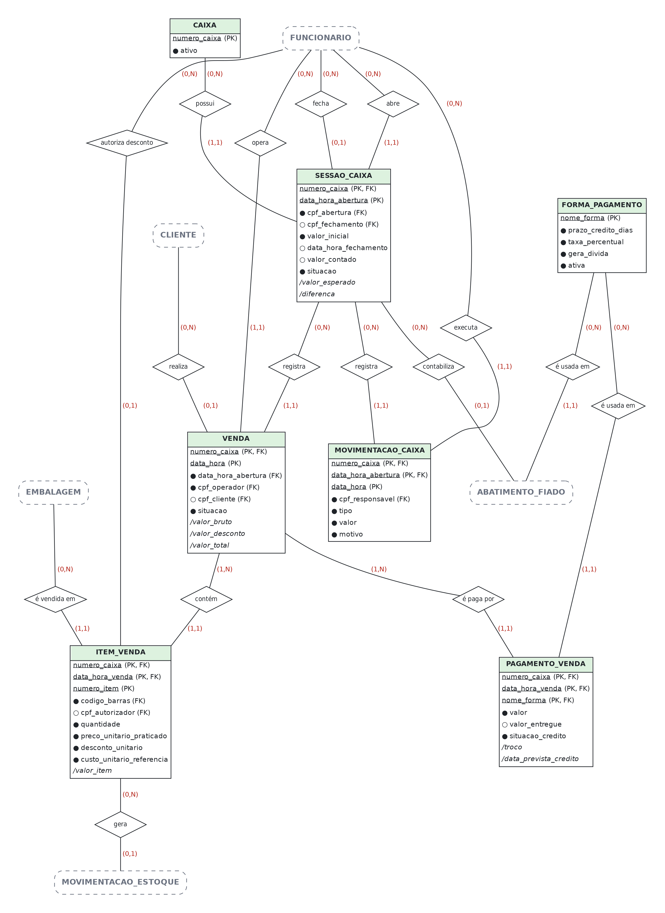

*Figura 11: módulo Vendas e Caixa.*

### 16.6 DER por módulo: Financeiro e Fiado

O fiado passa a funcionar como conta corrente: a dívida nasce da venda (R24) e diminui com abatimentos independentes (R32). Assim o cliente pode pagar aos poucos e cada pagamento fica registrado, como acontece hoje no mercado, só que sem o caderno.

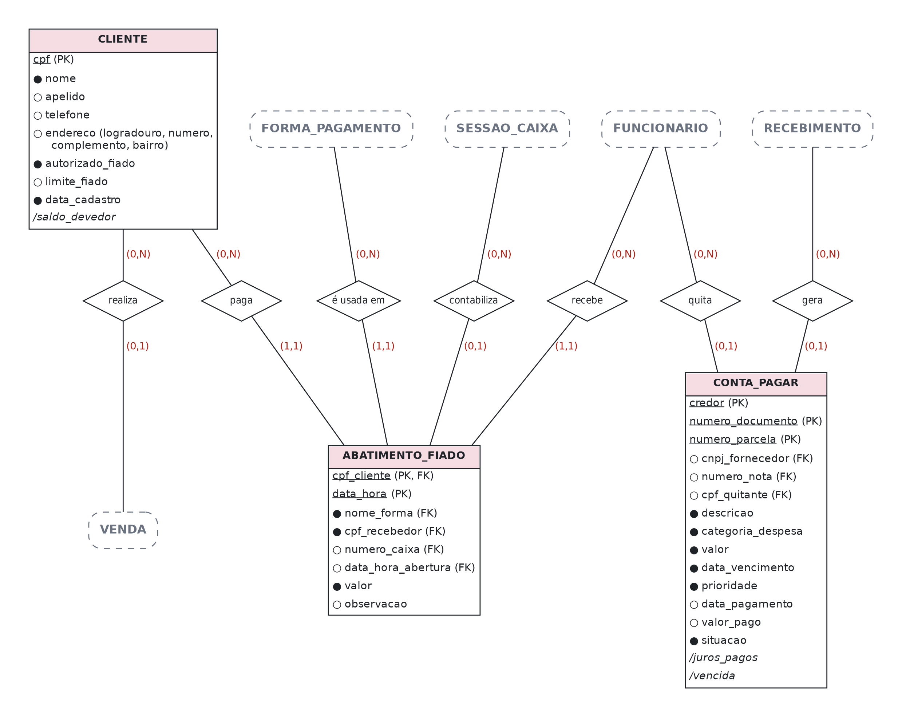

*Figura 12: módulo Financeiro e Fiado.*

### 16.7 DER por módulo: Pessoas e Acesso

Este módulo atravessa todos os outros e registra quem fez cada operação. FUNCIONARIO e PERMISSAO ficaram em N:N, em vez de um campo "cargo", porque no mercado as funções se sobrepõem: quem opera o caixa também altera preço, e quem fica na padaria também repõe gôndola.

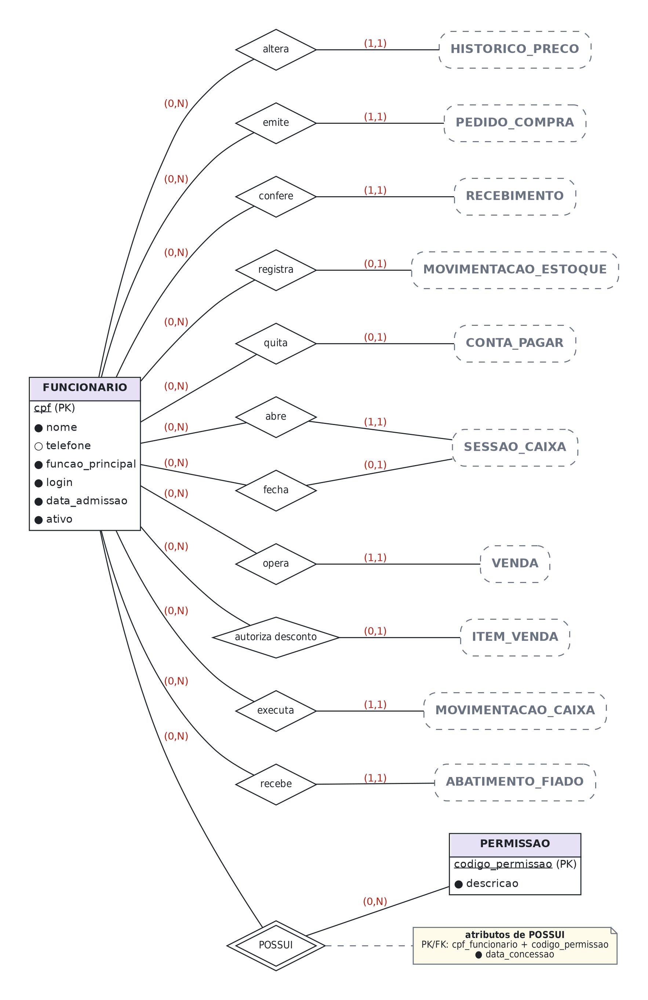

*Figura 13: módulo Pessoas e Acesso.*

---

## 17. Justificativas técnicas

Esta seção explica de onde veio cada decisão: o problema que a motivou, a alternativa descartada e a consequência prática. Depois vêm a matriz de rastreabilidade, a análise de evolução do modelo e as premissas adotadas.

### 17.1 Decisões de modelagem

#### D-01. Separar PRODUTO de EMBALAGEM

- **Decisão.** O produto é a unidade de estoque; a embalagem é a forma de venda, com código de barras, preço e fator de conversão próprios.
- **Por quê.** O mercado vende o mesmo item em formatos distintos (lata e fardo de cerveja, pacote e unidade de papel higiênico, produtos por quilo). Se código de barras e preço ficassem em PRODUTO, ou se criaria um "produto" diferente para cada formato, quebrando o controle de estoque e a análise de giro, ou se perderia o preço por formato.
- **Alternativa descartada.** Tratar cada formato como produto independente: simples de desenhar, mas impede responder "quanto de cerveja eu tenho?" e duplica cadastro, custo e validade.
- **Consequência.** Vender um fardo baixa 12 unidades do estoque (fator de conversão), e o saldo continua certo.

#### D-02. Criar LOTE em vez de guardar validade no produto

- **Decisão.** Validade, custo unitário e quantidade recebida pertencem ao lote.
- **Por quê.** Dois pacotes do mesmo arroz, comprados em datas diferentes, têm validades e custos diferentes. A prioridade nº 1 do gerente, a lista de validades, só é possível se a validade estiver na remessa, não no cadastro do produto.
- **Alternativa descartada.** Campo "data_validade" em PRODUTO: só funcionaria se o mercado tivesse um único lote de cada item por vez, o que é falso.
- **Consequência.** Permite FEFO na venda (RN-17), alerta de vencimento próximo (RF-17) e cálculo de perda por produto (RF-40). Das decisões do modelo, é a que mais afeta o resultado financeiro do mercado.

#### D-03. Todo saldo nasce de MOVIMENTACAO_ESTOQUE

- **Decisão.** O saldo do lote é atributo derivado; nenhuma alteração de estoque ocorre sem movimentação registrada, com tipo, motivo e responsável.
- **Por quê.** O problema declarado pelo mercado é não saber o estoque, e a causa é que as alterações não têm origem registrada. Um campo "quantidade" editável reproduziria o problema no sistema.
- **Alternativa descartada.** Guardar apenas o saldo atual: mais rápido de implementar, impossível de auditar. Quando o saldo divergisse, ninguém saberia por quê.
- **Consequência.** Perdas por vencimento, trocas com fornecedor, devoluções de cliente e ajustes de inventário passam a ser mensuráveis, cada um com seu tipo. O relatório de perdas que o gerente classificou como "muito" útil é consequência direta desta decisão.

#### D-04. Tipos de movimentação como domínio, e não como sete entidades

- **Decisão.** Entrada por recebimento, saída por venda, devolução, perda por vencimento, perda por avaria, troca com fornecedor e ajuste de inventário são valores do atributo tipo.
- **Por quê.** Todas têm a mesma estrutura (lote, quantidade, data, motivo, responsável). Uma entidade para cada tipo multiplicaria os relacionamentos sem acrescentar informação, erro que o manual chama de "colocar tudo como entidade".
- **Consequência.** Consultas de estoque percorrem uma única estrutura, e novos tipos de movimentação (por exemplo, consumo interno) podem ser incluídos sem alterar o modelo.

#### D-05. ITEM_VENDA como entidade associativa, com preço e custo congelados

- **Decisão.** O N:N entre VENDA e EMBALAGEM foi resolvido por uma entidade associativa que guarda quantidade, preço praticado, desconto e custo de referência.
- **Por quê.** Três motivos cumulativos: (a) o item tem atributos próprios; (b) o item precisa se relacionar com MOVIMENTACAO_ESTOQUE, e relacionamentos não se relacionam entre si; (c) preço e custo precisam ser fotografados no instante da venda, ou toda alteração futura de preço reescreveria o histórico e o lucro apurado (RN-22).
- **Consequência.** Torna possível a apuração de lucro (RF-38) e a análise de giro (RF-39), duas informações que o mercado hoje não consegue obter.

#### D-06. PAGAMENTO_VENDA separado de VENDA

- **Decisão.** O pagamento é uma entidade associativa entre VENDA e FORMA_PAGAMENTO, com valor, troco, situação de crédito e data prevista.
- **Por quê.** Uma venda pode ser paga em mais de uma forma, e cada forma tem prazo e taxa distintos. Um campo "forma_pagamento" em VENDA impediria o pagamento dividido e, principalmente, impediria prever quando o dinheiro estará disponível.
- **Consequência.** Permite separar o faturamento por forma de pagamento (PB-10), prever o caixa (RF-35) e emitir o alerta de insuficiência (RF-36), que o gerente disse querer "sim, muito".

#### D-07. Vincular a venda à SESSAO_CAIXA e ao FUNCIONARIO

- **Decisão.** Toda venda pertence a uma sessão de caixa aberta e registra o funcionário que a operou, mesmo a sessão já registrando quem abriu.
- **Por quê.** No mercado, um funcionário cobre o almoço de outro no mesmo caixa. Se a autoria ficasse só na sessão, as vendas feitas na cobertura iriam para a pessoa errada, e é esse tipo de confusão sobre alterações indevidas que o gerente quer evitar.
- **Consequência.** Permite responder "quem fez esta venda?" (PB-11) e conferir o caixa por sessão, comparando o valor esperado com o contado.

#### D-08. ABATIMENTO_FIADO ligado ao CLIENTE, e não à VENDA

- **Decisão.** O pagamento do fiado reduz o saldo devedor do cliente, sem quitar uma venda específica.
- **Por quê.** O mercado funciona assim: o cliente paga "o que dá", e o caderno registra o nome, não a compra. Ligar o abatimento a uma venda obrigaria o operador a escolher qual compra está sendo paga, escolha que ninguém faz hoje e que geraria dado falso.
- **Alternativa descartada.** Contas a receber por venda. Seria mais correto do ponto de vista contábil, mas não corresponde à prática e levaria a registros errados.
- **Consequência.** Saldo devedor é atributo derivado e confiável, com histórico completo de pagamentos parciais (PB-08). Se no futuro o mercado quiser baixa por compra, basta acrescentar o vínculo opcional entre abatimento e venda; o modelo não precisa ser refeito.

#### D-09. HISTORICO_PRECO como entidade

- **Decisão.** Cada alteração de preço é um registro, com preço anterior, novo, motivo, data/hora e autor; a embalagem guarda apenas o preço vigente.
- **Por quê.** O preço muda com frequência (reajuste do fornecedor, vencimento próximo) e as alterações são manuais e feitas por poucos funcionários. Sem histórico, não há como investigar um preço errado nem medir o efeito de um desconto por vencimento.
- **Consequência.** Atende RF-04 e RNF-02 e cria a base para analisar, no futuro, a relação entre desconto por vencimento e redução de perdas.

#### D-10. O preço de compra pertence ao par produto-fornecedor

- **Decisão.** Relacionamento N:N FORNECE com os atributos preco_ultima_compra, data_ultima_compra e codigo_no_fornecedor.
- **Por quê.** A entrevista é explícita: o mesmo leite custa quase um real a mais dependendo do fornecedor. O preço não é do produto nem do fornecedor; é da combinação.
- **Consequência.** O sistema pode responder "de quem comprar este item hoje?" e sustentar a formação de preço com base no custo real (RF-05, RF-07).

#### D-11. PERMISSAO em N:N com FUNCIONARIO, em vez de cargo

- **Decisão.** As autorizações são concedidas individualmente, com data de concessão.
- **Por quê.** No mercado, "cada funcionário possui uma função específica, mas podem exercer diferentes ações". Um modelo baseado em cargo não representaria a realidade e exigiria exceções imediatas.
- **Consequência.** Atende às políticas PO-01, PO-02, PO-04 e PO-11 sem enrijecer a operação, e permite que o mesmo funcionário acumule ou perca atribuições sem mudança estrutural.

#### D-12. CONTA_PAGAR genérica, com ou sem recebimento de origem

- **Decisão.** Uma única entidade representa parcelas de boleto de fornecedor e despesas fixas (Simples Nacional, folha, internet, água, luz, aluguel), com categoria, vencimento e prioridade.
- **Por quê.** O gerente precisa de uma visão única do que vai vencer; a origem do compromisso é secundária para a decisão de pagamento.
- **Consequência.** O alerta de caixa insuficiente (RF-36) considera todos os compromissos, e não apenas os de fornecedores. A prioridade, já usada informalmente, entra no modelo.

#### D-13. Chaves primárias naturais e chaves estrangeiras explícitas, sem chaves substitutas

- **Decisão.** Nenhuma entidade usa chave substituta (surrogate key, como um "id" numérico gerado apenas para o banco). Toda chave primária é formada por atributos que existem no negócio, e todo relacionamento do lado (1,1) ou (0,1) é materializado por chave estrangeira. O critério adotado para cada tipo de entidade foi:
  - **Cadastros com documento ou código oficial:** CPF (FUNCIONARIO, CLIENTE), CNPJ (FORNECEDOR), código de barras (EMBALAGEM).
  - **Cadastros com nome controlado:** nome da categoria, nome padronizado do produto, nome da forma de pagamento, código da permissão, número físico do caixa.
  - **Documentos:** a nota fiscal é identificada por (cnpj_fornecedor, numero_nota); a conta a pagar por (credor, numero_documento, numero_parcela).
  - **Eventos:** identificados pela entidade dona do evento mais o instante em que ocorreu: sessão de caixa (numero_caixa, data_hora_abertura), venda (numero_caixa, data_hora), pedido (cnpj_fornecedor, data_hora_pedido), abatimento (cpf_cliente, data_hora).
  - **Entidades dependentes:** herdam a PK da entidade de que dependem e acrescentam um discriminador do negócio: o item de venda usa o número do item impresso no cupom; o lote usa o produto dentro da nota; a movimentação usa o instante dentro do lote.
- **Por quê.** As chaves naturais carregam significado e protegem a integridade: como a FK de RECEBIMENTO para PEDIDO_COMPRA compartilha o cnpj_fornecedor, o modelo impede, pela própria estrutura, que uma nota de um fornecedor seja vinculada ao pedido de outro. Da mesma forma, CPF e CNPJ impedem o cadastro duplicado da mesma pessoa ou empresa.
- **Custo assumido.** (a) As chaves compostas se propagam: LOTE tem PK de três atributos, que MOVIMENTACAO_ESTOQUE herda. (b) Se um nome controlado mudar (por exemplo, o nome de um produto), a alteração precisa ser propagada às FKs. (c) Três exceções reais relatadas na entrevista passam a ter tratamento definido: produto sem código de barras recebe código interno (RN-04), cliente de fiado passa a informar CPF (RN-24) e todo fornecedor é identificado pelo CNPJ da nota (RN-12). Essas condições estão registradas como premissas na seção 17.4.
- **Consequência.** As chaves definidas aqui serão transpostas diretamente para as tabelas do modelo lógico, sem necessidade de criar identificadores artificiais.

#### D-14. Atributos derivados explicitamente marcados

- **Decisão.** Saldo de estoque, saldo devedor do cliente, totais da venda, valor esperado do caixa, diferença de caixa, juros pagos e dias para vencer são marcados como derivados.
- **Por quê.** Marcar que esses valores não são digitados evita a causa mais comum de inconsistência em sistemas pequenos: um total gravado que deixa de bater com as partes.
- **Consequência.** No modelo físico, eles poderão ser gravados para ganhar desempenho, desde que tenham regra de recálculo. A decisão fica registrada aqui para as próximas entregas.

### 17.2 Matriz de rastreabilidade

A matriz completa o teste de consistência. Ela mostra que cada problema gerou pelo menos um requisito, que cada requisito tem regra que o sustenta e que cada regra aparece no modelo. Uma linha incompleta indicaria incoerência entre os artefatos.

| Problema | Requisitos | Regras / políticas | Entidades e relacionamentos | Fluxo |
| --- | --- | --- | --- | --- |
| PB-01 | RF-09, RF-12, RF-15 | RN-14, RN-16 | RECEBIMENTO, LOTE, MOVIMENTACAO_ESTOQUE (R12, R14) | F1 |
| PB-02 | RF-15, RF-19, RF-20 | RN-16, PO-08 | LOTE, MOVIMENTACAO_ESTOQUE, PRODUTO.estoque_minimo (R13, R14) | F1, F2 |
| PB-03 | RF-12, RF-17, RF-21 | RN-15, RN-17 | LOTE.data_validade, CATEGORIA.dias_alerta (R12, R13) | F3 |
| PB-04 | RF-16, RF-18, RF-40 | RN-18, RN-19, PO-07 | MOVIMENTACAO_ESTOQUE.tipo, LOTE.situacao (R14, R15) | F3 |
| PB-05 | RF-05, RF-07 | RN-05, RN-09 | FORNECE (N:N, R05), LOTE.custo_unitario | F1 |
| PB-06 | RF-04 | RN-06, RN-07, PO-02 | HISTORICO_PRECO (R03, R04) | F1, F3 |
| PB-07 | RF-25, RF-27 | RN-24, RN-25, PO-04 | CLIENTE, VENDA (R24) | F2, F6 |
| PB-08 | RF-26 | RN-26, RN-27 | ABATIMENTO_FIADO (R32, R33, R34) | F6 |
| PB-09 | RF-22, RF-37 | RN-20, RN-21 | VENDA, ITEM_VENDA, SESSAO_CAIXA (R22, R25) | F2, F4 |
| PB-10 | RF-24, RF-37 | RN-21, RN-33 | PAGAMENTO_VENDA, FORMA_PAGAMENTO (R28, R29) | F2, F4 |
| PB-11 | RF-30, RF-42 | RN-35, PO-02, PO-11 | FUNCIONARIO, PERMISSAO (R04, R11, R23, R31, R34, R36) | Todos |
| PB-12 | RF-28, RF-29, RF-32 | RN-29, RN-30 | SESSAO_CAIXA, MOVIMENTACAO_CAIXA (R19, R30, R31) | F4 |
| PB-13 | RF-35, RF-36 | RN-33, RN-34 | PAGAMENTO_VENDA.data_prevista_credito, CONTA_PAGAR | F5 |
| PB-14 | RF-13, RF-33, RF-34, RF-41 | RN-31, RN-32, PO-06 | CONTA_PAGAR (R17, R18) | F1, F5 |
| PB-15 | RF-08, RF-10, RF-14 | RN-10, RN-11, RN-13 | PEDIDO_COMPRA, SOLICITA (N:N), RECEBIMENTO (R08, R09) | F1 |
| PB-16 | RF-39 | RN-22 | ITEM_VENDA, VENDA (R25, R26) | F2 |
| PB-17 | RF-38 | RN-22 | ITEM_VENDA.custo_unitario_referencia | F2, F4 |
| PB-18 | RF-03 | RN-04 | EMBALAGEM.codigo_barras (PK, código interno quando necessário) | F2 |
| PB-19 | RF-02, RF-23 | RN-02, RN-03 | EMBALAGEM.fator_conversao, PRODUTO.unidade_base (R02, R26) | F2 |
| PB-20 | RF-42 | RN-07, RN-08, RN-23, PO-01, PO-02, PO-11 | PERMISSAO, POSSUI (N:N, R36) | Todos |

### 17.3 Escalabilidade, integração e evolução do modelo

O manual pede que o DER sustente a evolução do sistema. Na prática, isso significa poder acrescentar partes sem reescrever as existentes. A tabela abaixo mostra as extensões previstas.

**Pontos de extensão já preparados**

| Evolução futura | O que seria necessário | Por que o modelo suporta |
| --- | --- | --- |
| Segunda loja ou depósito central | Criar LOCAL_ESTOQUE e vincular MOVIMENTACAO_ESTOQUE a origem e destino | Como todo saldo deriva de movimentações, basta qualificar cada movimentação com o local; nenhum saldo precisa ser recalculado manualmente |
| Importação de XML de nota fiscal | Preencher RECEBIMENTO e os lotes a partir do arquivo | A estrutura de recebimento já contempla número da nota, itens, quantidades, custo e parcelas; a importação substitui a digitação, sem mudar o modelo |
| Conciliação por operadora de cartão | Criar OPERADORA_CARTAO ligada a FORMA_PAGAMENTO | Prazo e taxa já estão isolados na forma de pagamento; a operadora entra como um nível acima, sem afetar vendas já registradas |
| Contas a receber formais por venda | Acrescentar vínculo opcional entre ABATIMENTO_FIADO e VENDA | O vínculo é aditivo; o histórico atual continua válido |
| Programa de fidelidade | Estender CLIENTE e criar pontuação sobre VENDA | CLIENTE já existe como entidade independente, e a venda já pode ser identificada |
| Etiquetas e balança integrada | Usar EMBALAGEM com código pesável | O fator de conversão e a unidade base já distinguem venda por peso de venda por unidade |
| Compras sugeridas automaticamente | Cruzar giro por produto, estoque mínimo e preço por fornecedor | Os três dados já existem no modelo: ITEM_VENDA, PRODUTO e FORNECE |
| Controle de inventário completo | Criar INVENTARIO e ITEM_INVENTARIO | O ajuste já é um tipo de movimentação; a contagem formal apenas acrescenta o documento que a originou |

**O que o modelo impede (propositalmente)**

- Alterar estoque sem registrar quem, quando e por quê (RNF-05, D-03).
- Apagar a dívida de um cliente sem deixar histórico do pagamento (RNF-06, D-08).
- Mudar o valor de uma venda passada ao reajustar um preço hoje (RN-22, D-05).
- Registrar venda sem caixa aberto, o que tornaria a conferência do dinheiro impossível (RN-20).
- Conceder fiado a cliente não identificado (RN-24, PO-04).

**Continuidade para as próximas entregas**

Nas próximas entregas (modelo lógico, normalização, modelo físico e banco de dados), este modelo vai gerar: (a) três tabelas associativas a partir dos N:N (produto-fornecedor, item de pedido e funcionário-permissão); (b) a normalização do multivalorado FORNECEDOR.contatos e do composto CLIENTE.endereco; (c) as chaves primárias e estrangeiras já definidas na seção 12.2, transpostas diretamente; e (d) a decisão de gravar ou calcular os atributos derivados da seção 15. Como as entidades vieram das regras de negócio, essas etapas não devem exigir mudanças nelas.

### 17.4 Premissas adotadas e lacunas da entrevista

As perguntas abaixo ficaram sem resposta, foram respondidas com "?", ficaram em aberto na entrevista ou surgiram da escolha de chaves naturais (D-13). Para cada uma adotamos uma premissa explícita, para que o modelo não dependa de suposições escondidas. Todas precisam ser confirmadas com o gerente antes da modelagem lógica.

| Lacuna | Premissa adotada | Risco se a premissa estiver errada |
| --- | --- | --- |
| "Vocês controlam os produtos por lote ou apenas pelo produto?" (sem resposta) | Hoje não há controle por lote; o lote é introduzido pelo sistema como condição para o controle de validade | Baixo: se já houvesse controle, o modelo continuaria válido; apenas a mudança de processo seria menor |
| "Como identificam o produto vendido quando ele possui código de barras?" (sem resposta) | Leitura por scanner, com busca manual por nome nos itens sem código | Baixo: confirmado indiretamente em outras respostas |
| "Dona Ivone e Marquinho também podem realizar vendas?" (sem resposta) | Tratados como funcionários com permissão de operar caixa, como os demais | Baixo: o modelo de permissões absorve qualquer configuração |
| Quem registra compras, recebimentos e altera estoque (perguntas 7.8 e 7.9 sem resposta) | Qualquer funcionário disponível recebe (PO-05), mas apenas quem tem permissão registra e ajusta estoque | Médio: pode exigir ajuste nas permissões, não no modelo |
| Controle de entradas e saídas de dinheiro (perguntas 6.1 e 6.2 sem resposta) | Não existe controle formal além do caderno de faturamento | Médio: se existir controle paralelo, haverá dado a migrar |
| Responsável por contas a pagar e a receber (6.14) e apuração de lucro (6.15), sem resposta | Ambas as atribuições são do gerente | Baixo: afeta permissões, não estrutura |
| Recebimento de cartão no planejamento financeiro (6.11 e 6.13), sem resposta | O crédito de cartão é considerado pela data prevista, e não pela data da venda | Médio: é premissa central do alerta de caixa (RF-36) e precisa ser validada |
| Prazos exatos de crédito e taxas por maquininha | Parametrizáveis em FORMA_PAGAMENTO, a preencher no cadastro | Baixo: o modelo já os trata como dado, e não como constante |
| Existência de devolução ao fornecedor sem vínculo com vencimento | Tratada como tipo de movimentação de estoque | Baixo |
| Todo fornecedor emite nota fiscal com CNPJ? (não perguntado) | Sim, distribuidores e vendedores entregam com nota; a nota é a PK do recebimento | Médio: compra informal sem nota exigiria outro identificador de documento |
| Clientes de fiado aceitam informar CPF? (hoje só o nome é anotado) | O CPF passa a ser exigido na concessão do fiado (PK de CLIENTE) | Médio: mudança de prática; precisa ser validada com o gerente |
| Nomes de produto são únicos? | O nome do produto é cadastrado em padrão único (tipo, marca e variação) e serve de PK | Baixo: exige disciplina de cadastro; renomear implica atualizar as FKs |
| Uma mesma nota pode trazer o mesmo produto com duas validades? | Considera-se um lote por produto em cada nota; havendo duas validades, registra-se a mais próxima | Baixo: situação rara; é conservadora para o controle de vencimento |
| Uma venda pode ser paga duas vezes na mesma forma (dois cartões de crédito)? | Registra-se um pagamento por forma em cada venda, com o valor somado | Baixo: não afeta faturamento nem previsão de crédito |
| Localização e razão social formal da empresa | Mantidas em aberto para preenchimento pela equipe | Nenhum impacto no modelo |

> **Observação metodológica.** Três respostas da entrevista mostram processos que hoje não existem ("não registramos", "não", "não sei responder"). Elas foram tratadas como origem de requisito: é onde o sistema precisa criar informação. Por isso PB-01, PB-04 e PB-12 deram origem a algumas das entidades mais importantes do modelo.

---

## 18. Conclusão

O Supermercado Parque Boturussu funciona há 17 anos com processos que dão certo, mas com a informação espalhada entre o sistema do caixa, os aplicativos das maquininhas, cadernos e papéis. A análise mostrou que quase todos os problemas vêm da mesma falta: a entrada de mercadoria não é registrada. Sem esse registro não há estoque, validade nem custo, e portanto não há lucro apurado.

O modelo conceitual desta entrega parte desse ponto. A sequência RECEBIMENTO → LOTE → MOVIMENTACAO_ESTOQUE atende as três prioridades do gerente. ITEM_VENDA, com preço e custo congelados, permite medir o lucro. PAGAMENTO_VENDA, com prazo de crédito, permite o alerta financeiro que o gerente pediu. E ABATIMENTO_FIADO substitui o caderno sem perder o histórico.

Cada entidade, atributo, relacionamento e cardinalidade deste documento pode ser ligado a uma resposta da entrevista, um problema, um requisito e uma regra de negócio. A seção 17.2 registra essas ligações.

As próximas etapas (modelo lógico, normalização e modelo físico) partem de um modelo derivado do funcionamento real do mercado. E se o mercado crescer, com uma segunda loja, importação de notas ou conciliação de cartões, o modelo pode ser estendido sem ser reescrito, como mostra a seção 17.3.

---

## Apêndice: teste de consistência e checklist

### Teste de consistência do manual

| Verificação | Situação | Evidência neste README |
| --- | --- | --- |
| A empresa está claramente caracterizada? | Sim | Seção 2: identificação, setores, rotina, informações críticas |
| Os processos representam a realidade? | Sim | Seção 5: oito processos com participantes, gatilho, informação gerada e fragilidade atual |
| Os problemas justificam o sistema? | Sim | Seção 4: 20 problemas, cada um com evidência literal da entrevista |
| Os requisitos respondem aos problemas? | Sim | Seções 6 e 7, com coluna de origem; consolidado na matriz (17.2) |
| As regras representam as condições do negócio? | Sim | Seção 8: 35 regras, cada uma com origem e impacto no modelo |
| Os fluxos representam processos e requisitos? | Sim | Seção 10: seis fluxogramas, cada um com requisitos e regras aplicadas |
| As entidades representam elementos relevantes? | Sim | Seção 11, incluindo os substantivos deliberadamente **rejeitados** (11.3) |
| Os atributos descrevem corretamente as entidades? | Sim | Seções 12 e 15, com classificação e regra por atributo |
| Os relacionamentos representam interações reais? | Sim | Seção 13: 36 relacionamentos, todos justificados |
| As cardinalidades estão justificadas por regra? | Sim | Seção 14: análise "vá e volte" de todos, mais a discussão das mínimas (14.1) |
| O DER representa tudo o que foi identificado? | Sim | Seção 16 e pasta [`docs/der/`](docs/der/) (visão geral em A3 e DER completo com todos os atributos) |

### Checklist final

**Contexto**
- [x] Empresa caracterizada
- [x] Escolha justificada
- [x] Processos identificados
- [x] Problemas identificados
- [x] Necessidades identificadas

**Requisitos**
- [x] 42 requisitos funcionais
- [x] 13 requisitos não funcionais
- [x] 35 regras de negócio
- [x] 12 restrições e políticas organizacionais

**Processos**
- [x] Processos representados
- [x] Seis fluxogramas
- [x] Coerência com os requisitos
- [x] Mapa de integração entre processos (Figura 1)

**Dados**
- [x] 21 entidades identificadas e justificadas
- [x] Atributos identificados e classificados
- [x] Dicionário conceitual completo (seção 15)

**Relacionamentos**
- [x] 36 relacionamentos
- [x] Cardinalidades definidas
- [x] Os dois sentidos analisados
- [x] N:N verificados (3)
- [x] Atributos de relacionamento analisados (4)

**DER**
- [x] Entidades representadas
- [x] Atributos associados
- [x] Relacionamentos e cardinalidades
- [x] Coerência com as regras
- [x] Integração demonstrada
- [x] Preparado para evolução

**Documentação**
- [x] Justificativas técnicas (17.1)
- [x] Rastreabilidade (17.2)
- [x] Premissas e lacunas (17.4)
- [x] README do repositório
- [x] Identificação da equipe

---

## Estrutura do repositório

```
.
├── README.md                          este documento
└── docs/
    ├── img/                           mapa de integração e fluxogramas (seções 5.1 e 10)
    │   ├── figura-01-integracao-processos.png
    │   ├── figura-02-f1-compra-recebimento.png
    │   ├── figura-03-f2-venda-caixa.png
    │   ├── figura-04-f3-validade-perdas.png
    │   ├── figura-05-f4-caixa.png
    │   ├── figura-06-f5-contas-pagar.png
    │   └── figura-07-f6-fiado.png
    ├── der/                           diagramas entidade-relacionamento (seção 16)
    │   ├── figura-08-der-visao-geral.png
    │   ├── figura-09-modulo-produtos-estoque.png
    │   ├── figura-10-modulo-compras-fornecedores.png
    │   ├── figura-11-modulo-vendas-caixa.png
    │   ├── figura-12-modulo-financeiro-fiado.png
    │   ├── figura-13-modulo-pessoas-acesso.png
    │   ├── figura-14-der-visao-geral-a3.png
    │   └── der-completo-atributos.png
    └── fonte/                         scripts que geram todas as figuras
        ├── model.py                   entidades, atributos e relacionamentos (seções 11 a 15)
        ├── gen.py, run.py             geração dos DERs
        └── flows.py                   geração do mapa de integração e dos fluxogramas
```

Todas as figuras também estão em SVG, com o mesmo nome, ao lado do PNG. Elas são geradas a partir dos scripts em `docs/fonte/` (requer Python 3 e [Graphviz](https://graphviz.org/)): qualquer alteração no modelo deve ser feita em `model.py`, e as imagens são regeneradas com `python3 run.py` e `python3 flows.py`, o que mantém diagramas e documentação sempre coerentes.
